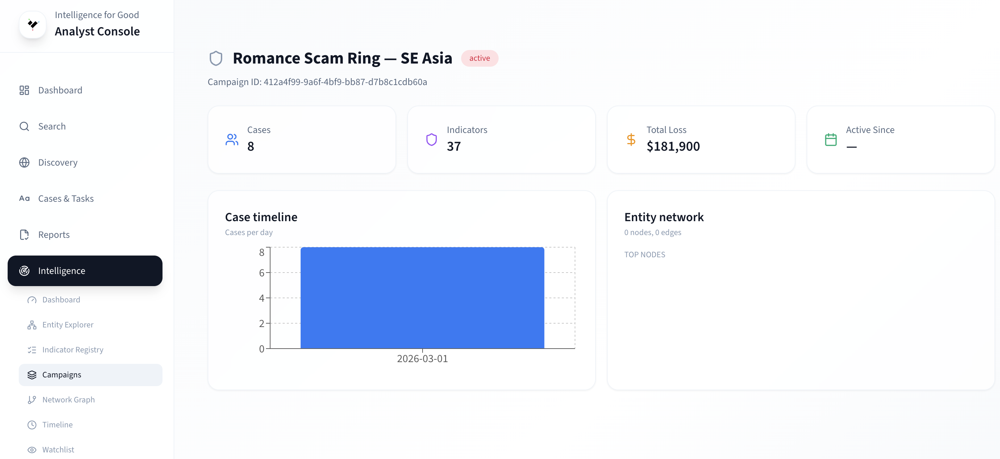

# Campaigns

The Campaigns page surfaces groups of related fraud cases that share
common [entities](../key-concepts/entities.md). To understand what
campaigns are and how they are detected, see
[Campaigns & Threat Networks](../key-concepts/campaigns.md).

## Browsing campaigns

Navigate to **Intelligence → Campaigns** to see the campaign list.
Each card shows the campaign name, status, case count, and risk
badge. Use the search field to filter by name or status.

Campaigns start as **detected** (auto-identified by the analytics
pipeline) and transition to **confirmed** once an analyst reviews
them.

## Managing campaigns

On the campaign detail page you can:

- **Rename** — click the campaign title, edit, and save.
- **Merge** — select two or more campaigns and use the "Merge"
  action. Cases from all selected campaigns move to the surviving
  campaign.
- **Split** — unlink cases that do not belong. They form a new
  campaign automatically.
- **Link/unlink cases** — use the "Manage" action to add or remove
  individual case IDs.

All management operations are logged in the audit trail.

## Creating a campaign manually

Click **New Campaign** on the Campaigns page. Provide a name and
description, then optionally link to a **governance category** from
the taxonomy. This connects your tactical detections to strategic
reporting — daily operations automatically credit the correct
high-level category.

## Campaign risk scores

The campaign risk score (0–100) combines:

| Factor               | Weight |
| -------------------- | ------ |
| Total loss           | 40%    |
| Linked case count    | 30%    |
| Entity co-occurrence | 20%    |
| Recency              | 10%    |

Campaigns scoring above 70 appear with a **red risk badge** and are
prioritized for LEA referral suggestions on the Intelligence
Dashboard.

## Tactical vs. strategic campaigns

The platform supports two complementary views:

| Aspect       | Active Campaign (tactical)      | Governance Category (strategic)  |
| ------------ | ------------------------------- | -------------------------------- |
| Speed        | Fast — daily/weekly changes     | Stable — quarterly/annual        |
| Creation     | Auto-detected or analyst-made   | Defined by policy teams          |
| Purpose      | Detect specific fraud waves now | Long-term reporting & compliance |
| Risk scoring | 0–100 composite score           | N/A                              |

When creating a campaign, link it to a governance category so that
tactical wins automatically feed strategic metrics.

## Viewing campaign details

The campaign detail page shows:

- **Timeline** — when cases entered the campaign.
- **Entity list** — shared entities that tie the cases together.
- **Linked cases** — all cases in the campaign with classification
  and status.
- **Risk badge** — the composite risk score with its breakdown.

Click **Open in Network Graph** to visualize the campaign's entity
network.

## Learn more

- [Campaigns & Threat Networks](../key-concepts/campaigns.md) —
  how campaigns are detected automatically.
- [Network Graph](network-graph.md) — visualize campaign entity
  relationships.
