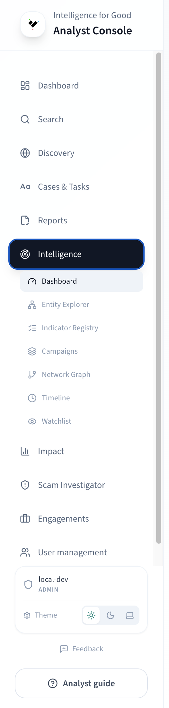
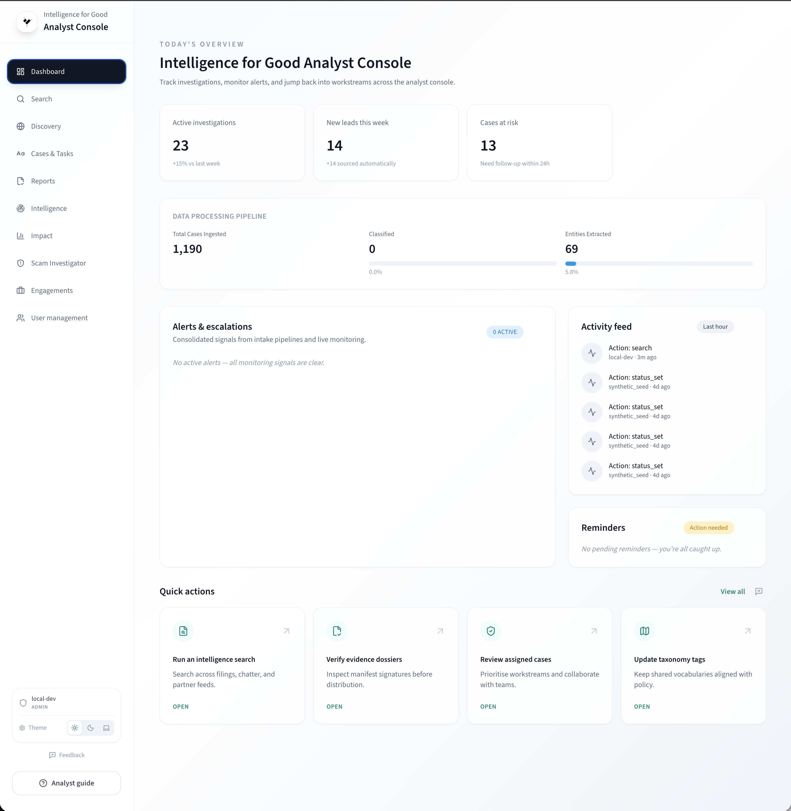

# Console Tour

A visual walkthrough of the I4G Console layout and navigation. By the
end of this page you will know where every tool lives in the sidebar.

## Sidebar navigation

The sidebar on the left is your primary navigator. It organizes the
Console into these sections:

| Section                  | What you find there                                               |
| ------------------------ | ----------------------------------------------------------------- |
| **Dashboard**            | KPI cards, alerts, activity feed, and quick-action buttons        |
| **Cases**                | Case queue with status, priority, and classification filters      |
| **Search**               | Hybrid search combining text queries with structured filters      |
| **Discovery**            | Semantic exploration of the case corpus                           |
| **Intelligence**         | Hub page for active threats, campaign alerts, and LEA suggestions |
| **Entity Explorer**      | Browse, search, and drill into threat entities                    |
| **Indicator Registry**   | Curated threat indicators with bulk export and STIX               |
| **Campaigns**            | Threat campaign list — auto-detected and manual                   |
| **Network Graph**        | Interactive force-directed entity relationship graph              |
| **Timeline**             | Multi-track activity view (cases, indicators, campaigns)          |
| **Watchlist**            | Pinned entities with alert monitoring                             |
| **SSI**                  | Scam site investigation — submit URLs, view results, live monitor |
| **Impact**               | KPI trends, geographic heatmap, taxonomy explorer                 |
| **Reports**              | Report Builder, Report Library, Evidence Dossiers                 |
| **Analytics**            | Program-level metrics and detection health charts                 |
| **Taxonomy**             | Browse and manage the fraud classification taxonomy               |
| **Admin** _(admin only)_ | User management, engagement administration                        |

## Dashboard

The Dashboard is your landing page. It shows:

- **KPI cards** — total cases, total loss, active threats, new
  indicators, median action time.
- **Alerts** — watchlist alerts and system notifications.
- **Activity feed** — recent actions across the platform.
- **Quick actions** — buttons to start a new search, open the case
  queue, or launch an SSI investigation.

If you are in an engagement, the Dashboard shows engagement-scoped
metrics automatically.

## Engagement selector

When your account is associated with one or more
[engagements](../key-concepts/engagements.md), a **selector dropdown**
appears near the top of the sidebar. Selecting an engagement scopes
every page to that engagement's cases and metrics.

## Keyboard shortcuts

The Console supports a global command palette. Press **Cmd+K**
(macOS) or **Ctrl+K** (Windows/Linux) to search for any page,
action, or entity by name.

## Next steps

- [Daily Workflow](daily-workflow.md) — learn the end-to-end rhythm.
- [Reviewing Cases](reviewing-cases.md) — dive into case triage.
