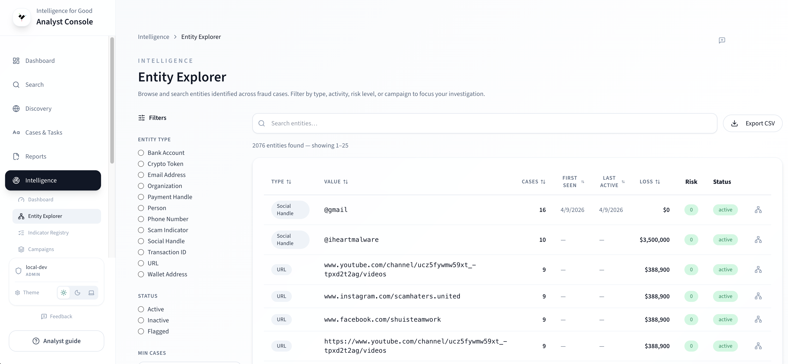
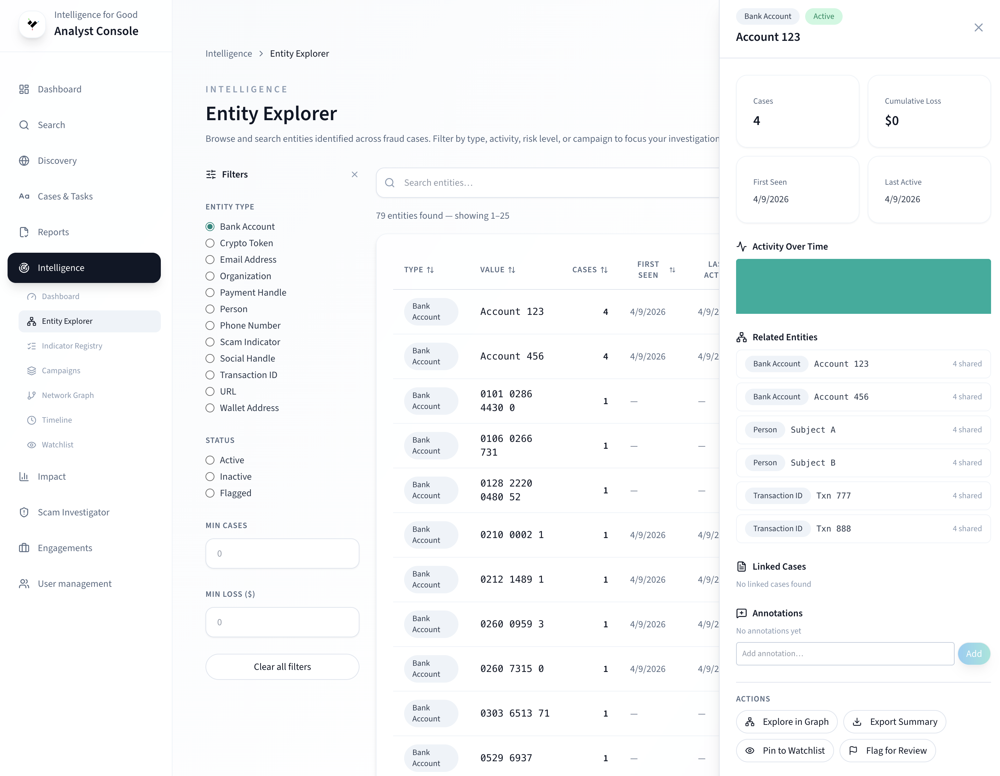

# Entity Explorer

The Entity Explorer lets you browse, search, and drill into
[threat entities](../key-concepts/entities.md) — crypto wallets, email
addresses, phone numbers, bank accounts, and other identifiers
extracted from fraud cases.

## Browsing entities

Open **Intelligence → Entity Explorer** from the sidebar. The main
view displays a paginated table sorted by total loss or case count.

<!-- TODO: Replace with actual screenshot -->
<!--  -->

Each row shows:

| Column          | Description                                  |
| --------------- | -------------------------------------------- |
| **Entity Type** | Category badge (e.g., wallet, email, domain) |
| **Value**       | The canonical identifier                     |
| **Status**      | Lifecycle status (see below)                 |
| **Case Count**  | Number of linked fraud cases                 |
| **Total Loss**  | Aggregate reported loss across linked cases  |
| **First Seen**  | Earliest case association date               |
| **Last Seen**   | Most recent case association date            |

### Entity lifecycle statuses

Each entity carries a lifecycle status reflecting its current threat
level. To understand how these statuses work, see
[Risk Scoring & Entity Lifecycle](../key-concepts/risk-scoring.md).

| Status        | Meaning                                                     |
| ------------- | ----------------------------------------------------------- |
| **Active**    | Appeared in a case within the last 14 days                  |
| **Declining** | No new case activity for 14–29 days                         |
| **Dormant**   | No new case activity for 30+ days                           |
| **Resolved**  | All linked cases are closed                                 |
| **Flagged**   | Manually flagged by an analyst — sticky, never auto-changes |

Status transitions happen automatically during the analytics
refresh. **Flagged** is the exception — only an analyst can set or
remove it.

## Searching and filtering

- **Search bar** — type a partial entity value to filter the table
  in real time.
- **Filter sidebar** — narrow results by entity type, minimum loss
  threshold, or date range.
- **Sort** — click column headers to reorder by case count, loss,
  or date.

## Entity detail

Click any row to open the entity detail panel.

<!-- TODO: Replace with actual screenshot -->
<!--  -->

The detail view includes:

- **Summary card** — full entity value, type badge, and aggregate
  statistics.
- **Activity sparkline** — case volume over time, showing when the
  entity was most active.
- **Co-occurrence graph** — a 1-hop neighbor view showing other
  entities that appear in the same cases. For a deeper exploration,
  open the full [Network Graph](network-graph.md).
- **Linked cases table** — every case that references this entity.

From the detail panel you can:

- **Pin to watchlist** — monitor the entity continuously. See
  [Watchlist & Alerts](watchlist-and-alerts.md).
- **Flag** — set the entity to Flagged status for persistent
  attention.
- **Open in Network Graph** — seed a graph from this entity.

## Exporting

Click the **Export** button above the table to download entity data
as CSV or XLSX.

## Role-based access

| Role       | Entity list       | Entity detail |
| ---------- | ----------------- | ------------- |
| Researcher | Last 4 chars only | Restricted    |
| Analyst+   | Full values       | Full access   |

Researchers see entity values masked for privacy. Full detail views
are restricted to analyst roles and above.

## Learn more

- [Entities](../key-concepts/entities.md) — what entities are and
  why they matter.
- [Threat Indicators](../key-concepts/indicators.md) — how entities
  become curated indicators.
