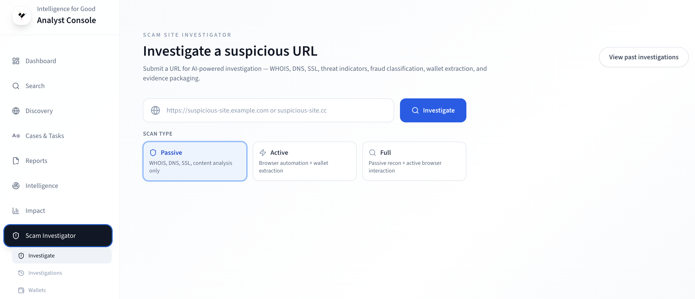
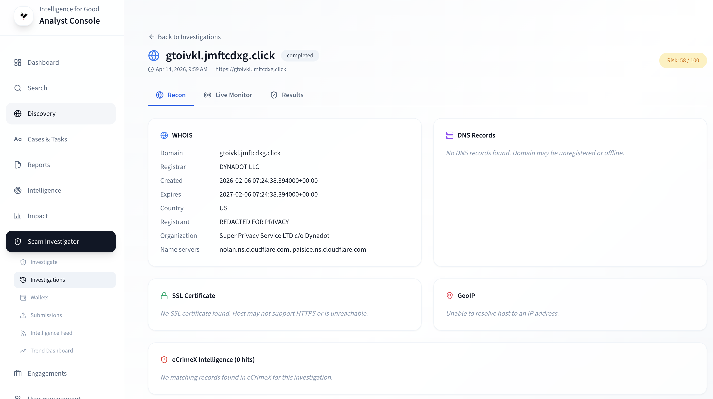
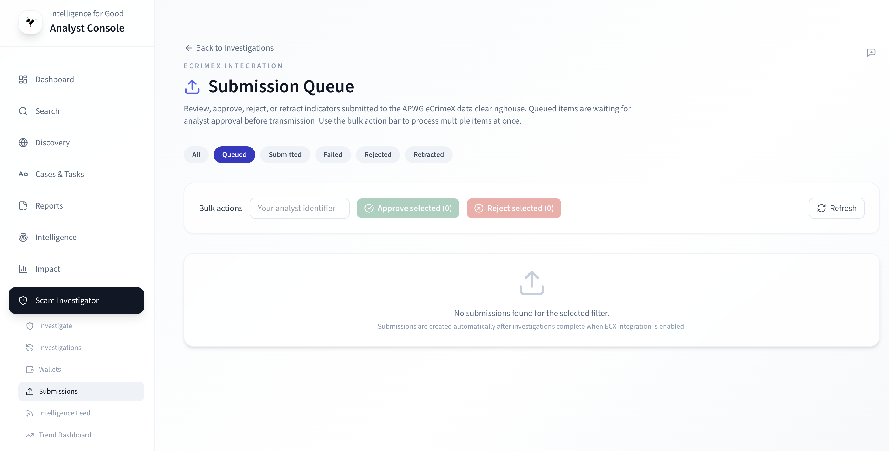
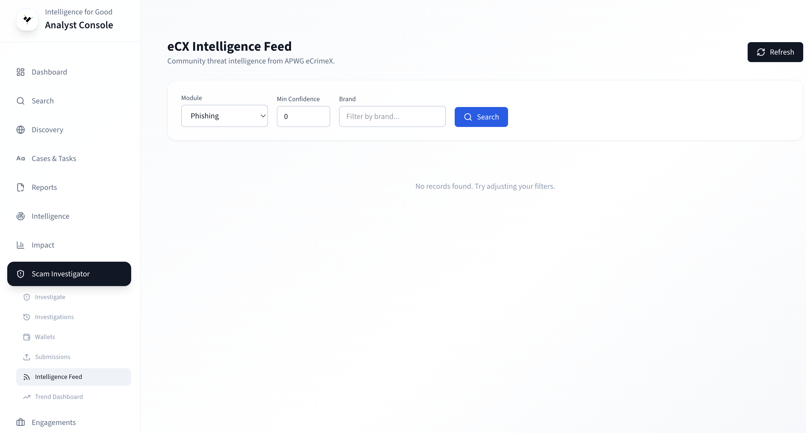
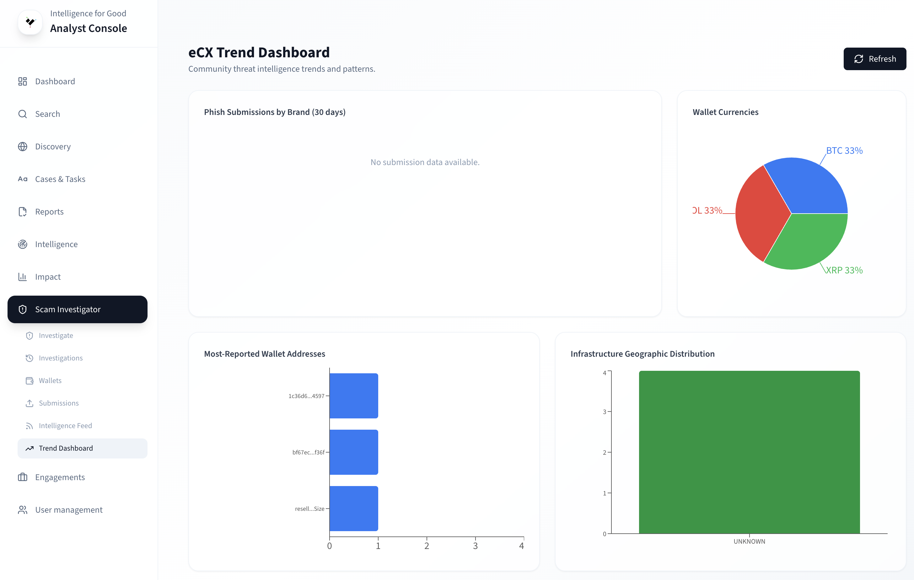

# Investigating Sites

I4G's Scam Site Investigator (SSI) automates analysis of suspicious
websites directly from the Console. To understand the concepts behind
site investigations, see
[Site Investigations](../key-concepts/site-investigations.md).

## Starting an investigation

1. Navigate to **SSI** from the sidebar.
2. Paste the URL you want to investigate.
3. Select a **scan type**:

| Scan type   | What happens                                      | Duration |
| ----------- | ------------------------------------------------- | -------- |
| **Passive** | OSINT enrichment only — no browser interaction    | 30–60 s  |
| **Active**  | Passive + AI agent interacts with the site        | 2–5 min  |
| **Full**    | Active + wallet extraction + fraud classification | 3–7 min  |

4. Optionally enable **Push to Core** to create a case automatically
   from the results.
5. Click **Investigate**.

<!-- TODO: Replace with actual screenshot -->
<!--  -->


Start with a **Passive** scan to assess the target. If the results
look suspicious, run a **Full** investigation for complete analysis.


## Passive scan results

A passive scan collects infrastructure intelligence without touching
the target site:

- **WHOIS** — registrar, creation/expiration dates, nameservers.
- **DNS** — A, MX, NS, TXT records.
- **SSL/TLS certificate** — issuer, validity, self-signed detection.
- **IP geolocation** — hosting country, city, ASN.
- **Full-page screenshot** — rendered via headless browser.
- **Form field inventory** — every input the site presents.
- **VirusTotal** — security engine detection count.
- **urlscan.io** — page analysis and reputation data.

Results appear on the investigation detail page organized into cards
for each data source.

## Full investigation (AI agent)

When you select **Active** or **Full**, the passive scan runs first,
then the AI agent takes over:

1. **Generates a synthetic identity** — a realistic but provably
   fake person with name, email, phone, and payment details. No real
   data is ever sent.
2. **Navigates the scam funnel** — the agent opens the site, fills
   forms, follows redirects, and takes a screenshot at every step.
3. **Records PII exposure** — tracks which data fields the site
   asked for and at which step.
4. **Classifies the scam** — applies the
   [fraud taxonomy](../key-concepts/fraud-taxonomy.md) with a risk
   score from 0–100.
5. **Extracts wallets** (Full scan only) — discovers cryptocurrency
   addresses on deposit and payment pages.

The agent uses playbooks (pre-defined sequences for known scam-site
patterns) when available, falling back to AI reasoning for unfamiliar
sites. Playbooks are faster, cheaper, and more reliable.

### Live monitoring

During active investigations, you can watch the agent work in real
time. See [Live Monitoring](live-monitoring.md) for details.

## Interpreting results

<!-- TODO: Replace with actual screenshot -->
<!--  -->

### Key findings to look for

| Finding                                  | What it means                             |
| ---------------------------------------- | ----------------------------------------- |
| Domain created days/weeks ago            | Scam sites are typically short-lived      |
| WHOIS privacy-protected or missing       | Common for hiding ownership               |
| Self-signed or very recent SSL cert      | Legitimate businesses use established CAs |
| Hosted in unexpected country             | Mismatch with claimed brand location      |
| Form asks for SSN, credit card, bank     | Red flags for a shopping/brand site       |
| VirusTotal detections > 0                | Security engines have flagged it          |
| Cryptocurrency wallets found             | Strong indicator of crypto scam           |
| Multiple pages collecting escalating PII | Scam funnel harvesting personal data      |

### Risk score

| Range  | Level    | Recommended action                         |
| ------ | -------- | ------------------------------------------ |
| 0–29   | Low      | Likely legitimate or insufficient data     |
| 30–59  | Medium   | Some suspicious indicators — manual review |
| 60–79  | High     | Multiple scam indicators present           |
| 80–100 | Critical | Strong evidence of fraud                   |

### Fraud classification

The investigation applies the five-axis
[taxonomy](../key-concepts/fraud-taxonomy.md): intent, channel,
techniques, requested actions, and claimed persona.

## Wallet extraction

Full investigations discover cryptocurrency addresses on scam sites.
The wallet table on the results page shows:

| Column     | Description                                  |
| ---------- | -------------------------------------------- |
| Address    | Wallet address (truncated, with copy button) |
| Token      | Token symbol (BTC, ETH, USDT, etc.)          |
| Network    | Blockchain network (Ethereum, Tron, Bitcoin) |
| Confidence | Extraction confidence (high / medium / low)  |
| Source     | Where on the page the address was found      |

### Wallet search (cross-investigation)

Navigate to **SSI → Wallets** to search wallet addresses across all
investigations. Filter by token, network, or address substring. This
view helps identify the same wallet appearing across multiple scam
sites — a strong signal of linked
[campaigns](../key-concepts/campaigns.md).

## eCrimeX integration

SSI integrates with the APWG eCrimeX data clearinghouse to enrich
investigations with community intelligence and contribute findings
back.

### Submissions

Navigate to **SSI → Submissions** to manage the eCrimeX submission
queue. Investigations with high risk scores can be submitted to the
eCrimeX community automatically or queued for analyst review:

| Risk score | Action                    |
| ---------- | ------------------------- |
| 80+        | Auto-submitted            |
| 50–79      | Queued for analyst review |
| Below 50   | Skipped                   |

From the submissions page you can approve, reject, or retract
submissions.

<!-- TODO: Replace with actual screenshot -->
<!--  -->

### Intelligence Feed

Navigate to **SSI → Intelligence Feed** to browse records polled
from eCrimeX. The feed shows phishing URLs, malicious domains, IPs,
and cryptocurrency addresses reported by the community. Use module
filters to narrow results.

Qualifying records from the feed can trigger SSI investigations
automatically and link into threat campaigns.

<!-- TODO: Replace with actual screenshot -->
<!--  -->

### eCrimeX Dashboard

Navigate to **SSI → eCX Dashboard** for analytics on your eCrimeX
activity:

- **Submissions by status** — count of auto-submitted, approved, and
  rejected.
- **Submission hit rate** — percentage of indicators that appear in
  community queries.
- **Enrichment coverage** — percentage of investigations enriched by
  eCrimeX data.
- **Volume trends** — time-series of submissions and enrichments.

<!-- TODO: Replace with actual screenshot -->
<!--  -->

## Browsing past investigations

Navigate to **SSI → Investigations** to search and filter all
completed investigations. Click any row to re-open the investigation
detail page with full results, wallet tables, and evidence downloads.

## Evidence downloads

From the investigation results page you can download:

- **PDF report** — formatted for law enforcement presentations.
- **Evidence ZIP** — all artifacts with SHA-256 integrity hashes.
- **Wallet manifest** — extracted wallets with token and network
  metadata.
- **STIX 2.1 bundle** — for import into threat intelligence
  platforms (MISP, OpenCTI).

## Learn more

- [Site Investigations](../key-concepts/site-investigations.md) —
  conceptual overview of SSI.
- [Live Monitoring](live-monitoring.md) — watch the AI agent in
  real time.
- [Reports & Dossiers](reports-and-dossiers.md) — all intelligence
  products.
