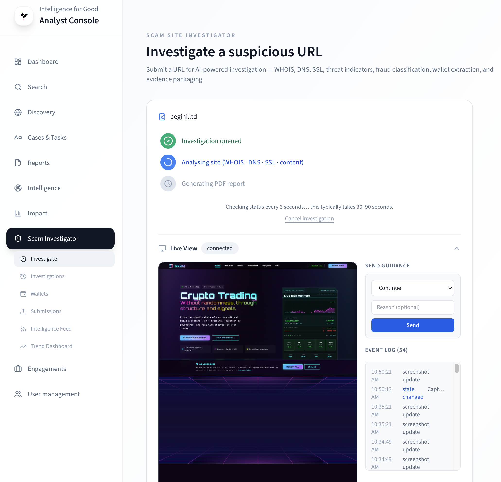

# Live Monitoring

During active and full [site investigations](investigating-sites.md),
you can watch the AI agent work in real time and intervene when it
needs help.

## Opening the monitor

1. Start an investigation from **SSI** with **Active** or **Full**
   scan type.
2. Open the investigation detail page and switch to the **Live
   Monitor** tab.

<!-- TODO: Replace with actual screenshot -->
<!--  -->

## What you see

The monitor displays four elements:

- **Live screenshot** — updated after every agent action. Shows
  exactly what the agent sees on the scam site.
- **Action log** — a scrolling timeline of agent decisions: page
  loads, form fills, button clicks, wallet discoveries, and state
  changes.
- **State indicator** — the current agent state (loading site,
  navigating, filling forms, extracting wallets, complete, etc.).
- **Guidance panel** — appears when the agent requests human help
  (see below).

## Guidance commands

When the agent encounters a situation it cannot resolve — a CAPTCHA,
an ambiguous UI element, or an unexpected page — it pauses and shows
a guidance panel asking for your input.

| Command      | What it does                      |
| ------------ | --------------------------------- |
| **Click**    | Click an element you describe     |
| **Type**     | Type text into a field            |
| **Go to**    | Navigate to a specific URL        |
| **Skip**     | Skip the current step and move on |
| **Continue** | Resume autonomous operation       |

Type your instruction in the text input and click **Send**. The
agent executes the command and resumes its workflow.

## Tips

- Guidance requests are rare — most investigations complete
  autonomously. When they do appear, respond promptly to avoid
  timeouts.
- Use **Skip** if the agent is stuck on a non-essential page element
  (e.g., a cookie banner or newsletter popup).
- Use **Continue** after the agent resolves a CAPTCHA if you
  completed it manually in another tab (local mode only).

## After the investigation completes

Once the agent reaches the **Complete** state, the Results tab
activates automatically. Switch to it to review the risk score,
wallet table, PII exposure summary, and evidence downloads. See
[Investigating Sites](investigating-sites.md) for interpreting
results.

## Learn more

- [Investigating Sites](investigating-sites.md) — the full SSI
  workflow.
- [Site Investigations](../key-concepts/site-investigations.md) —
  conceptual overview.
