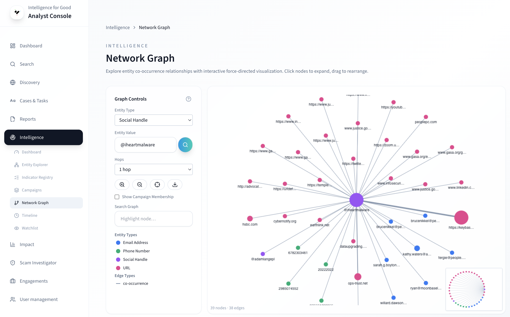

# Network Graph

The Network Graph visualizes
[entity](../key-concepts/entities.md) relationships as an
interactive force-directed graph. Use it to explore how wallets,
emails, phones, IPs, and domains connect across cases.

<!-- TODO: Replace with actual screenshot -->
<!--  -->

## Seeding a graph

1. Navigate to **Intelligence → Network Graph**.
2. Enter a seed entity (e.g., a wallet address or email).
3. Set the **hop count** (1–3) to control how far the traversal
   extends from the seed.
4. Click the search button to load the graph.

Higher hop counts reveal deeper clusters but produce denser
visualizations. Start with 1 hop and expand as needed.

## Visual encoding

The graph uses color coding so you can read patterns at a glance:

| Entity type | Color  |
| ----------- | ------ |
| Wallet      | Red    |
| Email       | Blue   |
| Phone       | Green  |
| IP address  | Amber  |
| Domain      | Purple |
| URL         | Pink   |

- **Node size** scales with case count — larger nodes appear in
  more cases.
- **Edge colors** indicate relationship types (co-occurrence,
  transaction, communication).
- **Dashed edges** represent infrastructure relationships (shared IP,
  registrar, or hosting provider). Toggle these with the
  **Infrastructure** checkbox in the filter panel.

## Filtering

- **Entity type filter** — restrict displayed nodes to specific
  types (wallet, email, phone, ip, domain, url).
- **Risk threshold slider** — hide nodes below a minimum risk score
  to focus on high-risk entities.

## Campaign seeding

Instead of a single entity, you can seed the graph from a
[campaign](../key-concepts/campaigns.md). Navigate to a campaign
detail page and click **Open in Network Graph**. The graph loads all
entities associated with that campaign, revealing its full entity
network at a glance.

## Temporal animation

The timeline slider lets you animate how the graph grew over time:

1. Click the **Timeline** toggle in the graph toolbar.
2. Use the date slider or **Play** button to step through time.
3. Nodes appear as they enter the dataset, with edges following.

This is useful for identifying when a campaign entity network
expanded or when a new wallet was introduced.

## Community clusters

Toggle **Clusters** in the toolbar to activate automatic community
detection. The graph highlights dense subgroups with shared colors
and displays a cluster summary showing each community's size,
average risk score, and entity type breakdown.

Adjust the **Resolution** slider to produce more or fewer clusters.

## Exporting

Click the download button to export the current graph view:

- **PNG** — raster image for reports and presentations.
- **SVG** — vector image for high-quality print or editing.

Exported images capture the current layout, zoom level, and filters.

## Learn more

- [Entities](../key-concepts/entities.md) — what threat entities are.
- [Campaigns](../key-concepts/campaigns.md) — how cases cluster into
  campaigns.
