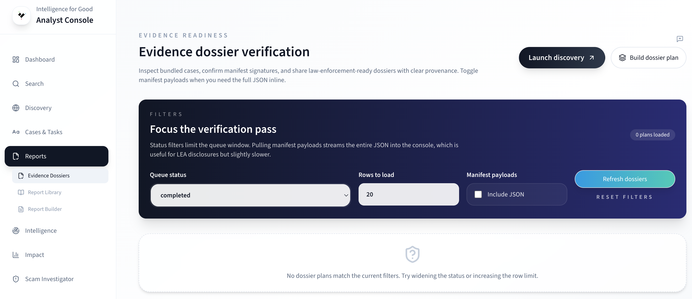

# Reports & Dossiers

The Console produces several types of intelligence products. This
page covers the Report Builder, Report Library, and Evidence Dossiers.
To understand what these products are and how they relate, see
[Dossiers & Reports](../key-concepts/dossiers-and-reports.md).

## Report Builder

Navigate to **Reports → Builder** to create a new report.

1. **Select a template** — choose from the available templates.
2. **Define scope** — enter a Campaign ID, entity filter, or date
   range. Leave blank for a platform-wide summary.
3. **Set TLP** — each template has a default Traffic Light Protocol
   label. Override it if your role permits.
4. **Generate** — the report is queued for background processing and
   appears in the Report Library when complete.

### Templates

| Template             | TLP default | Use case                            |
| -------------------- | ----------- | ----------------------------------- |
| Executive Summary    | TLP:AMBER   | Periodic briefing for leadership    |
| LEA Evidence Dossier | TLP:RED     | Law enforcement referral package    |
| Campaign Bulletin    | TLP:AMBER   | Campaign-specific threat brief      |
| SAR Supplement       | TLP:AMBER   | Supporting evidence for SAR filings |

## Report Library

Navigate to **Reports → Library** to browse previously generated
reports. The table shows template type, scope summary, TLP label,
status, creation date, and a download link for completed reports.

Reports carry a TLP classification that controls distribution:

| TLP       | Audience                            |
| --------- | ----------------------------------- |
| TLP:WHITE | Public / unrestricted               |
| TLP:GREEN | Community / organizational sharing  |
| TLP:AMBER | Internal / limited external sharing |
| TLP:RED   | Named recipients only (e.g., LEA)   |

## Evidence Dossiers

Navigate to **Reports → Dossiers** to review signed evidence bundles
before sharing with law enforcement partners.

### Browsing dossiers

Filter by **Status** (completed, pending, leased, failed) and set
the number of rows to load. Each card shows:

- Plan ID and jurisdiction.
- Total loss and case count.
- Warning counts (if any artifacts failed verification).
- Chips for manifest and signature paths.

### Verifying signatures

Two verification options are available on each dossier card:

1. **Verify signatures** — the server checks artifact hashes against
   the signed manifest. Review the results: all verified, missing
   count, and mismatch count.
2. **Verify client-side** — computes hashes in your browser against
   expected values. Useful for independent verification without
   relying on the server.

If verification failures repeat, contact your administrator to
regenerate the bundle.

### Downloading artifacts

The downloads panel provides:

- **PDF**, **HTML**, **Markdown** — the rendered dossier report.
- **Manifest** and **Signature manifest** — for programmatic use.
- File hashes and sizes for verification.

### Sharing with partners

Use the **LEA handoff** banner to copy artifact links. Remind
partners to download the `.signatures.json` alongside the PDF for
independent verification. See
[Law Enforcement Guide](../law-enforcement-guide/working-with-reports.md)
for recipient instructions.

Record the verification result (timestamp and hash snippets) in your
case notes for audit purposes.

## SSI investigation artifacts

Site investigations produce their own output artifacts. On the
investigation results page you can download:

- **PDF report** — formatted for law enforcement and presentations.
- **Evidence ZIP** — all artifacts with SHA-256 integrity hashes.
- **Wallet manifest** — extracted wallet addresses with metadata.
- **STIX 2.1 bundle** — for import into threat intelligence
  platforms (MISP, OpenCTI).

See [Investigating Sites](investigating-sites.md) for the full SSI
workflow.

## Learn more

- [Dossiers & Reports](../key-concepts/dossiers-and-reports.md) —
  report types, chain of custody, and digital signatures.
- [Report Authenticity](../security/report-authenticity.md) —
  how verification works.
