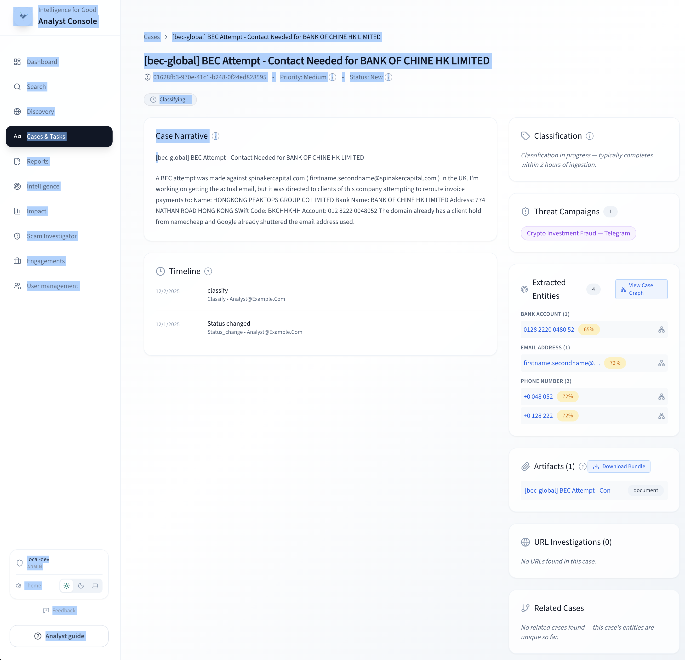

# Reviewing Cases

This is the core analyst loop: read the narrative, inspect evidence,
classify the scam, annotate entities, and decide what happens next.

## Opening a case

From the **Cases** queue, click any row to open the case detail page.
The detail page has several sections arranged around a central
narrative panel.

<!-- TODO: Replace with actual screenshot -->
<!--  -->

## Reading the narrative

The main panel displays the victim's report as formatted text. Key
details are highlighted:

- **Extracted entities** are annotated inline — wallet addresses,
  emails, phone numbers, and URLs appear as clickable chips.
  Click any entity chip to jump to its
  [Entity Explorer](entity-explorer.md) detail.
- **Redacted fields** such as victim contact information appear as
  `[VICTIM_EMAIL]`, `[VICTIM_PHONE]`. If the original value is
  needed for an investigation, request decryption from an admin
  through your secure channel.

## Inspecting evidence

Below the narrative you will find the **Evidence** section:

- **Attachments** — screenshots, chat logs, receipts, voice notes,
  and other files the victim uploaded.
- **Timeline** — a chronological view of the scam interaction,
  showing when each piece of evidence was created.
- **Extracted entities table** — all
  [entities](../key-concepts/entities.md) found in this case, with
  type, value, confidence score, and extraction source.

Review each piece of evidence carefully. Scammers often include
wallet addresses or contact details in screenshots that differ from
the narrative text — the extraction pipeline catches these too.

## Classifying the case

Apply the five-axis [fraud taxonomy](../key-concepts/fraud-taxonomy.md)
using the classification panel on the right side:

| Axis                 | Question it answers                    | Examples                         |
| -------------------- | -------------------------------------- | -------------------------------- |
| **Intent**           | What is the scammer trying to achieve? | Romance, Investment, Imposter    |
| **Channel**          | How did they reach the victim?         | Chat, Social Media, Email        |
| **Technique**        | What deception methods were used?      | Trust Building, Urgency, Fees    |
| **Requested Action** | What was the victim asked to do?       | Send Crypto, Wire Transfer       |
| **Claimed Persona**  | Who did the scammer pretend to be?     | Romantic Partner, Bank, Exchange |

Select one value per axis from the dropdown menus. If a case involves
multiple techniques or channels, choose the primary one.

## Assigning a risk score

Below the taxonomy panel, set a risk score (0–100) reflecting the
severity of the threat. Consider:

- **Financial loss** — higher amounts warrant higher scores.
- **Entity activity** — entities linked to many cases suggest an
  active campaign.
- **Victim vulnerability** — self-harm indicators or elderly victims
  may warrant escalation regardless of score.

## Annotating entities

Click any entity in the extracted entities table to:

- **Confirm or reject** — mark whether the extraction is correct.
- **Flag** — set the entity to
  [Flagged status](../key-concepts/risk-scoring.md) for persistent
  monitoring. Flagged status is sticky and never auto-transitions.
- **Add to watchlist** — pin the entity for continuous alert
  monitoring. See [Watchlist & Alerts](watchlist-and-alerts.md).

## Taking action

When your review is complete, use the action buttons:

- **Close Case** — marks the case as resolved in the queue.
- **Share** — shares the case with partners or team members.
- **Link to Campaign** — associates the case with a
  [threat campaign](campaigns.md) if it shares entities with other
  cases.

## Investigation status

If a [site investigation](investigating-sites.md) has been run for
URLs in this case, an **Investigation Status** panel appears showing:

- Investigation result summary (risk score, scan type).
- Link to the full SSI investigation detail page.
- Option to re-investigate if the site has changed.

## Tips

- Check the [Network Graph](network-graph.md) when you see
  high-activity entities — visual patterns often reveal campaign
  structures faster than tables.
- Use consistent taxonomy classifications across similar cases.
  Inconsistency degrades the analytics that drive grant reporting.
- Write analyst notes in factual, neutral language. Avoid PII in
  free-text fields.
