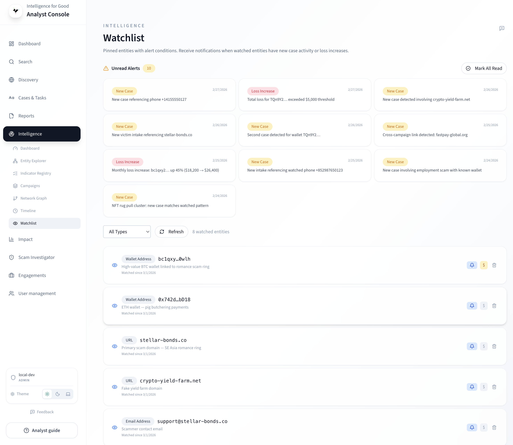

# Watchlist & Alerts

The watchlist lets you pin [entities](../key-concepts/entities.md)
for continuous monitoring. When new case activity or loss thresholds
are reached, the platform generates alerts automatically.

## Pinning an entity

You can pin entities from two places:

- **Entity Explorer** — click **Pin to Watchlist** next to any
  entity in the table or detail panel.
- **Watchlist page** — use the **Add Entity** form (enter entity
  type and value).

When pinning, you can optionally set:

- **Alert threshold** — a USD loss amount that triggers an alert
  when exceeded.
- **Note** — free-text context for why you are monitoring this
  entity.

## Managing your watchlist

Open **Intelligence → Watchlist** to see all pinned entities.

<!-- TODO: Replace with actual screenshot -->
<!--  -->

The table shows:

| Column              | Description                             |
| ------------------- | --------------------------------------- |
| **Entity Type**     | Wallet, email, domain, IP address, etc. |
| **Value**           | The canonical entity value              |
| **Alert Threshold** | USD amount that triggers a loss alert   |
| **Case Count**      | Current number of linked cases          |
| **Created**         | When the entity was pinned              |
| **Note**            | Free-text analyst note                  |

Use the row actions to **edit** the threshold or note, or **remove**
the entity from your watchlist.

## Alerts

The platform checks your watchlist entities on a regular schedule
and generates alerts when:

- **New activity** — the entity appears in cases that were not
  present at the last check.
- **Loss threshold** — the entity’s cumulative total loss exceeds
  your configured alert threshold.

### Viewing alerts

Switch to the **Alerts** tab on the Watchlist page. Each alert
shows:

- Entity type and value.
- Alert type (new activity or loss threshold).
- Message with details.
- Timestamp.

### Managing alerts

- Click an individual alert to mark it as read.
- Use the **Mark all as read** button to clear the alert list.

## Tips

- Pin high-activity wallets and domains you discover during case
  review to catch new victims automatically.
- Set conservative loss thresholds on financial entities — a
  threshold breach often signals an active campaign.
- Review your watchlist weekly and remove resolved entities to keep
  the alert volume manageable.

## Learn more

- [Risk Scoring & Entity Lifecycle](../key-concepts/risk-scoring.md)
  — how entity statuses change over time.
- [Entity Explorer](entity-explorer.md) — where to find and pin
  entities.
