# Data Pipeline

How evidence moves from upload to a signed, verifiable dossier. (Replace the placeholder with the latest pipeline diagram.)

## Stages at a glance

1. **Submit & protect** — Users upload chats, screenshots, or receipts. The API normalizes content and immediately tokenizes PII so only masked data flows downstream.
2. **Extract & enrich** — OCR and classifiers find entities (wallets, emails, phones), detect language/sentiment, and tag scam type. Related cases are linked.
3. **Store safely** — Canonical PII is locked in the vault; case data lands in the structured store + SQL for filters; evidence files go to protected buckets.
4. **Search & triage** — Hybrid search (keywords + semantic vectors) lets analysts and LEOs find patterns without exposing identities.
5. **Report & sign** — The report generator assembles findings into a dossier, signs it (hash manifest + signatures), and shares via controlled links.
6. **Feedback loop** — Outcomes and signals feed back into detectors and playbooks, improving precision over time.
