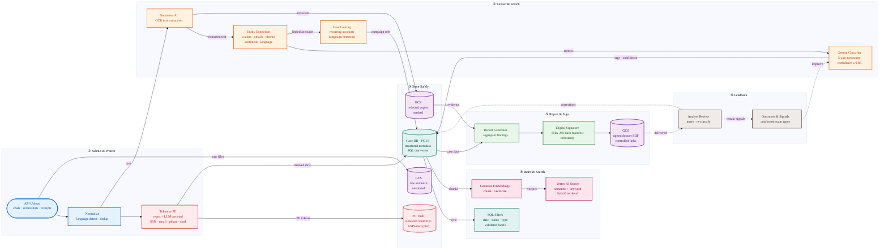

# Data Pipeline

How evidence moves from upload to a signed, verifiable dossier.

```mermaid
%%{init: {'theme':'base', 'themeVariables': {'fontSize':'16px', 'fontFamily':'system-ui, sans-serif'}, 'flowchart': {'curve':'basis', 'padding':20}}}%%
flowchart LR
    classDef intake    fill:#e3f2fd,stroke:#1565c0,stroke-width:2px,color:#0d47a1
    classDef process   fill:#fff3e0,stroke:#e65100,stroke-width:2px,color:#bf360c
    classDef secure    fill:#ffebee,stroke:#c62828,stroke-width:2px,color:#b71c1c
    classDef store     fill:#e0f2f1,stroke:#00695c,stroke-width:2px,color:#004d40
    classDef index     fill:#fce4ec,stroke:#ad1457,stroke-width:2px,color:#880e4f
    classDef report    fill:#e8f5e9,stroke:#2e7d32,stroke-width:2px,color:#1b5e20
    classDef storage   fill:#f3e5f5,stroke:#6a1b9a,stroke-width:2px,color:#4a148c
    classDef feedback  fill:#efebe9,stroke:#5d4037,stroke-width:2px,color:#3e2723

    subgraph S1["① Submit & Protect"]
        Upload(["API Upload<br/>chats · screenshots · receipts"]):::intake
        Normalize["Normalize<br/>language detect · dedup"]:::intake
        TokenPII["Tokenize PII<br/>regex + LLM-assisted<br/>SSN · email · phone · card"]:::secure
    end

    subgraph S2["② Extract & Enrich"]
        OCR["Document AI<br/>OCR text extraction"]:::process
        Classify["Gemini Classifier<br/>5-axis taxonomy<br/>confidence ≥ 0.85"]:::process
        Entity["Entity Extraction<br/>wallets · emails · phones<br/>sentiment · language"]:::process
        Link["Case Linking<br/>recurring accounts<br/>campaign detection"]:::process
    end

    subgraph S3["③ Store Safely"]
        VaultDB[("PII Vault<br/>isolated Cloud SQL<br/>KMS-encrypted")]:::secure
        CaseDB[("Case DB · PG 15<br/>structured metadata<br/>SQL dual-write")]:::store
        RawBucket[("GCS<br/>raw evidence<br/>versioned")]:::storage
        CleanBucket[("GCS<br/>redacted copies<br/>masked")]:::storage
    end

    subgraph S4["④ Index & Search"]
        Embed["Generate Embeddings<br/>chunk · vectorize"]:::index
        VectorDB["Vertex AI Search<br/>semantic + keyword<br/>hybrid retrieval"]:::index
        SQLFilter["SQL Filters<br/>date · status · type<br/>validated facets"]:::store
    end

    subgraph S5["⑤ Report & Sign"]
        Assemble["Report Generator<br/>aggregate findings"]:::report
        Sign["Digital Signature<br/>SHA-256 hash manifest<br/>timestamp"]:::report
        Dossier[("GCS<br/>signed dossier PDF<br/>controlled links")]:::storage
    end

    subgraph S6["⑥ Feedback"]
        Analyst["Analyst Review<br/>notes · re-classify"]:::feedback
        Outcomes["Outcomes & Signals<br/>confirmed scam types"]:::feedback
    end

    Upload --> Normalize
    Normalize --> TokenPII

    TokenPII -- "PII tokens" --> VaultDB
    TokenPII -- "masked data" --> CaseDB
    Upload -- "raw files" --> RawBucket

    Normalize -- "text" --> OCR
    OCR -- "extracted text" --> Entity
    Entity -- "entities" --> Classify
    Classify -- "tags · confidence" --> CaseDB
    Entity -- "linked accounts" --> Link
    Link -- "campaign refs" --> CaseDB
    OCR -- "redacted" --> CleanBucket

    CaseDB -- "sync" --> SQLFilter
    CaseDB -- "chunks" --> Embed
    Embed -- "vectors" --> VectorDB

    CaseDB -- "case data" --> Assemble
    CleanBucket -- "evidence" --> Assemble
    Assemble --> Sign
    Sign --> Dossier

    Dossier -. "delivered" .-> Analyst
    Analyst -. "corrections" .-> CaseDB
    Analyst -. "retrain signals" .-> Outcomes
    Outcomes -. "improve" .-> Classify
```

> **Diagram too small?** <a href="https://github.com/intelligenceforgood/docs/blob/main/book/architecture/data-pipeline.md" target="_blank" rel="noopener">View the full-size interactive diagram on GitHub</a>.

## Stages at a glance

1. **Submit & protect** — Users upload chats, screenshots, or receipts. The API normalizes content, detects language, deduplicates, and immediately tokenizes PII (regex + LLM-assisted detection of SSN, email, phone, card numbers) so only masked data flows downstream.
2. **Extract & enrich** — Document AI performs OCR; entity extraction finds wallets, emails, phones, and sentiment. The Gemini classifier applies the 5-axis taxonomy (scam intent, channel, social engineering, action, persona) with confidence thresholds. Related cases are linked by recurring accounts and campaign patterns.
3. **Store safely** — Canonical PII is encrypted (AES-256-GCM) and locked in the vault (isolated GCP project); case metadata lands in Cloud SQL with SQL dual-write; evidence files go to versioned GCS buckets (raw + redacted copies).
4. **Search & triage** — Embeddings are generated and indexed in Vertex AI Search for hybrid retrieval (semantic + keyword). SQL filters provide date, status, and type facets. Analysts search without exposing identities.
5. **Report & sign** — The report generator assembles findings from case data and redacted evidence into a dossier PDF, signs it with a SHA-256 hash manifest and timestamp, and publishes via controlled links.
6. **Feedback loop** — Analyst corrections and outcome signals feed back into the classifier, improving precision over time.
