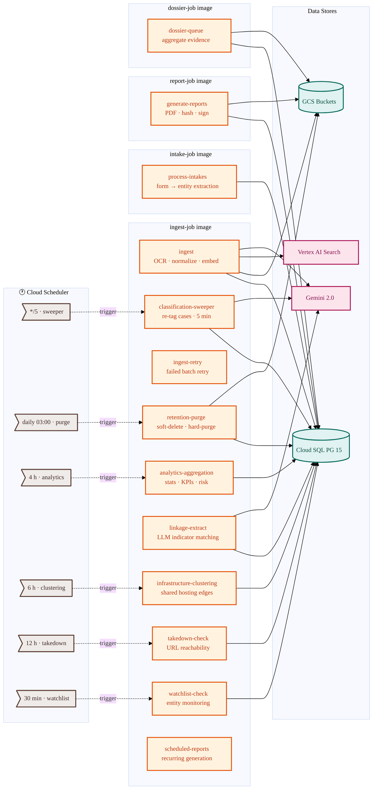

# Job Architecture

Cloud Run Jobs handle batch processing, analytics computation, and data lifecycle management. This page is the authoritative reference for all background jobs deployed on the platform.

## Overview

The platform runs **14 background jobs** across **5 Docker images**. Most analytics and maintenance jobs share the `ingest-job` image for cost efficiency; four core jobs have dedicated images (ingestion, intake, report, dossier), and the SSI eCrimeX poller runs on the `ssi-svc` image.

Mermaid source (click to expand)

## Job Inventory

| Job                           | CLI Command                          | Docker Image  | Trigger        | Purpose                                               |
| :---------------------------- | :----------------------------------- | :------------ | :------------- | :---------------------------------------------------- |
| **Ingestion Worker**          | `i4g jobs ingest`                    | `ingest-job`  | On-demand / CI | Batch JSONL processing: OCR, normalize, embed         |
| **Intake Worker**             | `i4g jobs intake`                    | `intake-job`  | On-demand      | Process user submissions, validate, extract entities  |
| **Report Generator**          | `i4g jobs report`                    | `report-job`  | On-demand      | Render Jinja2 → Markdown → PDF, hash, sign            |
| **Dossier Processor**         | `i4g jobs dossier`                   | `dossier-job` | Queue-driven   | Aggregate evidence, build relationship graphs         |
| **Classification Sweeper**    | `i4g jobs classify`                  | `ingest-job`  | `*/5 * * * *`  | Re-classify pending cases via taxonomy + LLM          |
| **Retention Purge**           | `i4g jobs retention-purge`           | `ingest-job`  | `0 3 * * *`    | Soft-delete → hard-purge resolved cases (90 + 30 day) |
| **Analytics Aggregation**     | `i4g jobs analytics`                 | `ingest-job`  | Every 4 hours  | Compute entity/indicator/campaign stats, KPIs         |
| **Linkage Extraction**        | `i4g jobs linkage-extract`           | `ingest-job`  | Post-intake    | LLM-driven financial indicator matching               |
| **Watchlist Check**           | `i4g jobs watchlist-check`           | `ingest-job`  | Every 30 min   | Monitor pinned entities for new activity              |
| **Infrastructure Clustering** | `i4g jobs infrastructure-clustering` | `ingest-job`  | Every 6 hours  | Discover shared-hosting entity relationships          |
| **Takedown Check**            | `i4g jobs takedown-check`            | `ingest-job`  | Every 12 hours | Verify URL reachability, detect site takedowns        |
| **Scheduled Reports**         | `i4g jobs scheduled-reports`         | `ingest-job`  | Cadence-based  | Trigger recurring report generation                   |
| **Ingest Retry**              | `i4g jobs ingest-retry`              | `ingest-job`  | On-demand      | Retry failed ingestion batches                        |
| **SSI eCrimeX Poller**        | `ssi ecx poll`                       | `ssi-svc`     | `*/15 * * * *` | Poll eCrimeX for new scam intelligence and sync to DB |

## Docker Image Mapping

Five distinct images are built via `scripts/build_image.sh`:

| Image         | Dockerfile                      | Jobs Included                                                                                                   |
| :------------ | :------------------------------ | :-------------------------------------------------------------------------------------------------------------- |
| `ingest-job`  | `docker/ingest-job.Dockerfile`  | Ingest, Sweeper, Retry, Retention Purge, Analytics, Linkage, Watchlist, Clustering, Takedown, Scheduled Reports |
| `intake-job`  | `docker/intake-job.Dockerfile`  | Intake Worker                                                                                                   |
| `report-job`  | `docker/report-job.Dockerfile`  | Report Generator                                                                                                |
| `dossier-job` | `docker/dossier-job.Dockerfile` | Dossier Processor                                                                                               |
| `ssi-svc`     | `docker/ssi-svc.Dockerfile`     | SSI eCrimeX Poller (includes Playwright + Chromium)                                                             |

> The `ingest-job` image includes `tesseract-ocr` and is the largest; all TIFAP analytics jobs reuse it to avoid duplicating dependencies.

## Scheduling

Jobs are triggered by Cloud Scheduler or on-demand via the CLI. The scheduler creates triggers in **PAUSED** state by default; operators enable them per environment.

| Schedule         | Job                       | Notes                                                                      |
| :--------------- | :------------------------ | :------------------------------------------------------------------------- |
| `*/15 * * * *`   | SSI eCrimeX Poller        | Every 15 minutes                                                           |
| `*/5 * * * *`    | Classification Sweeper    | Every 5 minutes                                                            |
| `0 3 * * * UTC`  | Retention Purge           | Daily at 03:00 UTC                                                         |
| Every 4 hours    | Analytics Aggregation     | Configurable via `I4G_ANALYTICS__REFRESH_INTERVAL_MINUTES`                 |
| Every 6 hours    | Infrastructure Clustering | Configurable via `I4G_ANALYTICS__INFRASTRUCTURE_CLUSTERING_INTERVAL_HOURS` |
| Every 12 hours   | Takedown Check            | Configurable via `I4G_ENRICHMENT__TAKEDOWN_CHECK_INTERVAL_HOURS`           |
| Every 30 minutes | Watchlist Check           | Configurable via `I4G_ANALYTICS__WATCHLIST_CHECK_INTERVAL_MINUTES`         |

For the full engineering reference including key logic and env vars, see `core/docs/design/jobs.md`.
