# Security Model

How we protect user identity and sensitive data.

## Principles

- **Zero Trust:** All services require authentication.
- **Token Exchange:** Users exchange credentials for ID tokens via Identity Platform.
- **Encryption:** PII is encrypted at the application layer using Cloud KMS before storage.
