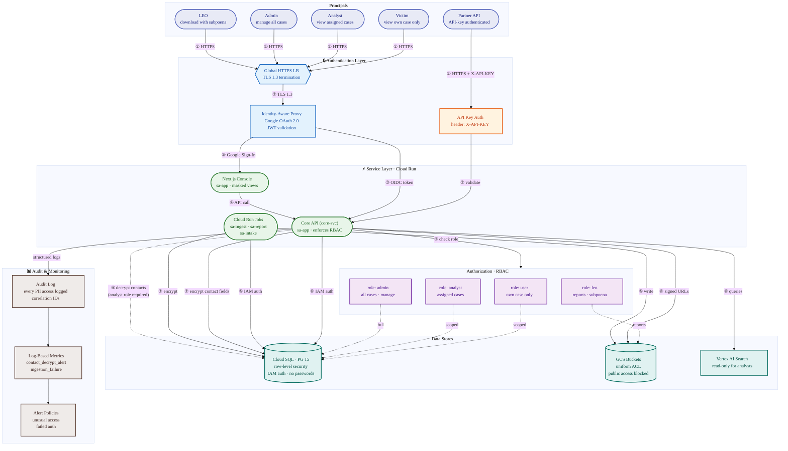

# Security Model

How we keep victims' data safe while delivering evidence law enforcement can trust.

Mermaid source (click to expand)

```mermaid
%%{init: {'theme':'base', 'themeVariables': {'fontSize':'16px', 'fontFamily':'system-ui, sans-serif'}, 'flowchart': {'curve':'basis', 'padding':20}}}%%
flowchart TB
    classDef user      fill:#e8eaf6,stroke:#5c6bc0,stroke-width:2px,color:#1a237e
    classDef edge      fill:#e3f2fd,stroke:#1565c0,stroke-width:2px,color:#0d47a1
    classDef auth      fill:#fff3e0,stroke:#e65100,stroke-width:2px,color:#bf360c
    classDef service   fill:#e8f5e9,stroke:#2e7d32,stroke-width:2px,color:#1b5e20
    classDef data      fill:#e0f2f1,stroke:#00695c,stroke-width:2px,color:#004d40
    classDef monitor   fill:#efebe9,stroke:#5d4037,stroke-width:2px,color:#3e2723
    classDef kms       fill:#fce4ec,stroke:#ad1457,stroke-width:2px,color:#880e4f
    classDef role      fill:#f3e5f5,stroke:#6a1b9a,stroke-width:2px,color:#4a148c

    subgraph Principals["👤 Principals"]
        Victim(["Victim<br/>view own case only"]):::user
        AnalystU(["Analyst<br/>view assigned cases"]):::user
        Admin(["Admin<br/>manage all cases"]):::user
        LEOUser(["LEO<br/>download with subpoena"]):::user
        Partner(["Partner API<br/>API-key authenticated"]):::user
    end

    subgraph AuthLayer["🔒 Authentication Layer"]
        LB{{"Global HTTPS LB<br/>TLS 1.3 termination"}}:::edge
        IAP["Identity-Aware Proxy<br/>Google OAuth 2.0<br/>JWT validation"]:::edge
        APIKey["API Key Auth<br/>header: X-API-KEY"]:::auth
    end

    subgraph RBAC["🔑 Authorization · RBAC"]
        direction LR
        RoleUser["role: user<br/>own case only"]:::role
        RoleAnalyst["role: analyst<br/>assigned cases"]:::role
        RoleAdmin["role: admin<br/>all cases · manage"]:::role
        RoleLEO["role: leo<br/>reports · subpoena"]:::role
    end

    subgraph ServiceLayer["⚡ Service Layer · Cloud Run"]
        Console(["Next.js Console<br/>sa-app · masked views"]):::service
        API(["Core API (core-svc)<br/>sa-app · enforces RBAC"]):::service
        Workers(["Cloud Run Jobs<br/>sa-ingest · sa-report<br/>sa-intake"]):::service
    end

    subgraph DataZone["💾 Data Stores"]
        CaseDB[("Cloud SQL · PG 15<br/>row-level security<br/>IAM auth · no passwords")]:::data
        Evidence[("GCS Buckets<br/>uniform ACL<br/>public access blocked")]:::data
        VectorStore["Vertex AI Search<br/>read-only for analysts"]:::data
    end

    subgraph AuditZone["📊 Audit & Monitoring"]
        AuditLog["Audit Log<br/>every PII access logged<br/>correlation IDs"]:::monitor
        Alerts["Alert Policies<br/>unusual access<br/>failed auth"]:::monitor
        Metrics["Log-Based Metrics<br/>contact_decrypt_alert<br/>ingestion_failure"]:::monitor
    end

    Victim -- "① HTTPS" --> LB
    AnalystU -- "① HTTPS" --> LB
    Admin -- "① HTTPS" --> LB
    LEOUser -- "① HTTPS" --> LB
    Partner -- "① HTTPS + X-API-KEY" --> APIKey

    LB -- "② TLS 1.3" --> IAP
    APIKey -- "② validate" --> API

    IAP -- "③ Google Sign-In" --> Console
    IAP -- "③ OIDC token" --> API

    Console -- "④ API call" --> API
    API -- "⑤ check role" --> RBAC

    RoleUser -. "scoped" .-> CaseDB
    RoleAnalyst -. "scoped" .-> CaseDB
    RoleAdmin -. "full" .-> CaseDB
    RoleLEO -. "reports" .-> Evidence

    API -- "⑥ IAM auth" --> CaseDB
    API -- "⑥ signed URLs" --> Evidence
    API -- "⑥ queries" --> VectorStore
    Workers -- "⑥ IAM auth" --> CaseDB
    Workers -- "⑥ write" --> Evidence

    API -- "⑦ encrypt contact fields" --> CaseDB
    Workers -- "⑦ encrypt" --> CaseDB

    API -. "⑧ decrypt contacts<br/>(analyst role required)" .-> CaseDB

    API -- "structured logs" --> AuditLog
    AuditLog --> Metrics
    Metrics --> Alerts
```

## Core safeguards

- **Immediate protection:** Victim contact fields (reporter name, email, phone, handle) are Fernet-encrypted at intake time and stored as ciphertext in the main database. Analysts see redaction markers (`[VICTIM_EMAIL]`, `[VICTIM_PHONE]`) unless they explicitly request decryption via the contact endpoint.
- **No separate vault:** Encrypted fields live in the same Cloud SQL instance as case data, eliminating cross-project complexity. The encryption key (`I4G_CRYPTO__PII_KEY`) is stored in Secret Manager.
- **Audited decryption:** Decrypting victim contact information requires analyst role and is fully audit-logged with correlation IDs via `GET /intakes/{id}/contact`.
- **Encryption everywhere:** TLS 1.3 in transit; AES-256-GCM at rest with KMS-wrapped keys rotated every 90 days. Signed dossiers include SHA-256 hash manifests for verification.
- **Least privilege:** Four RBAC roles (user, analyst, admin, leo) limit visibility. Row-level security scopes queries by `assigned_to`. Cloud SQL uses IAM auth — no stored passwords. Seven service accounts follow least-privilege bindings.
- **Proactive monitoring:** Log-based metrics trigger alerts on unusual contact decryption access, failed authentication, ingestion failures, and signature mismatches.

## Why it matters

- Victims stay protected while their cases move forward.
- Partners and donors see a compliant, auditable path from intake to court-ready evidence.
- The architecture scales without relaxing privacy guarantees.

## Analytics & Partner Feed Security (Sprint 6)

### Researcher Role Restrictions

Researcher-role users receive HTTP 403 for case detail, entity detail, and export endpoints. Aggregate views (dashboard KPIs, indicator counts) are accessible. This prevents PII exposure while allowing statistical analysis.

### TLP Enforcement

The partner indicator feed API accepts a `tlp` query parameter (default: `TLP:AMBER`). Indicators are tagged with the requested TLP level. Server-side TLP classification per indicator is a future enhancement.

### Export Audit Logging

All export operations (CSV, XLSX, STIX, PDF reports) are logged to the `audit_log` table with actor, format, filter parameters, and result counts. Partner feed accesses are logged separately to `partner_feed_audit`.

### Partner API Authentication

Partner organizations authenticate via `X-Partner-API-Key` header. Keys are stored as SHA-256 hashes — raw keys are never persisted. Each key has:

- Per-key rate limiting (`rate_limit_per_minute`)
- Expiration control (`expires_at`)
- Activation toggle (`is_active`)
- Full audit trail (`partner_feed_audit`)

### PII Anonymization in Analytics

Analytics aggregation tables (`entity_stats`, `indicator_stats`) contain only canonical values and aggregate statistics. When records are purged, entity values are replaced with SHA-256 hashes (S1-28 anonymization strategy). The partner feed API exposes only indicator categories, types, and aggregate counts — no PII fields.

For the end-to-end evidence flow showing where encryption occurs, see [Data Pipelines](data-pipeline.md). For threat analytics built on these safeguards, see [Threat Intelligence](threat-intelligence.md).
