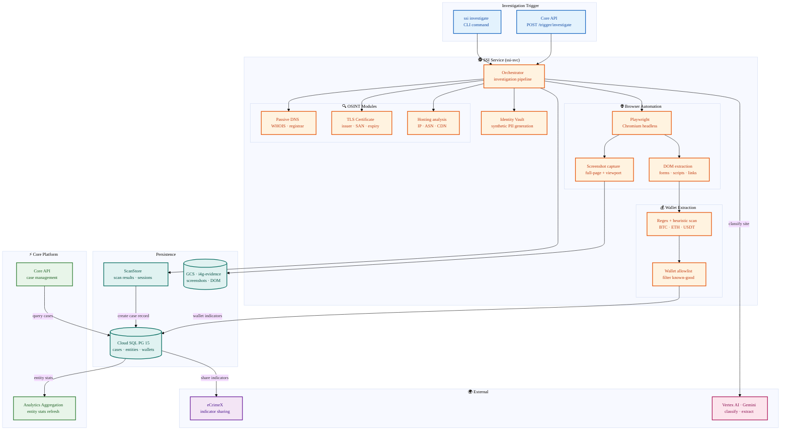

# SSI Architecture

The Scam Site Investigator (SSI) is an always-on Cloud Run service that automates browser-based reconnaissance, OSINT collection, and cryptocurrency wallet extraction for suspected scam websites.

## Investigation Flow



<details>
<summary>Mermaid source (click to expand)</summary>



</details>

## Key Components

| Component             | Location                               | Purpose                                                                  |
| :-------------------- | :------------------------------------- | :----------------------------------------------------------------------- |
| **Orchestrator**      | `src/ssi/investigator/orchestrator.py` | Entry point; coordinates browser, OSINT, and wallet extraction steps     |
| **Browser Module**    | `src/ssi/browser/`                     | Playwright-based page navigation, screenshot capture, DOM extraction     |
| **OSINT Modules**     | `src/ssi/osint/`                       | Passive DNS, WHOIS, TLS certificate, and hosting analysis                |
| **Wallet Extraction** | Embedded in orchestrator               | Regex + heuristic scanning for cryptocurrency addresses (BTC, ETH, USDT) |
| **Identity Vault**    | `src/ssi/identity/vault.py`            | Generates synthetic PII for safe interaction with suspicious sites       |
| **ScanStore**         | `src/ssi/store/scan_store.py`          | Persists scan results and creates cases via direct DB writes             |
| **Wallet Allowlist**  | `config/wallet_allowlist.json`         | Filters known-good exchange/service wallets from indicator submissions   |

## Integration with Core

SSI writes directly to the shared database — it does **not** go through the Core API for data persistence. This design keeps investigation latency low and avoids circular API dependencies.

| Integration Point             | Direction      | Mechanism                                                                               |
| :---------------------------- | :------------- | :-------------------------------------------------------------------------------------- |
| **Case creation**             | SSI → DB       | `ScanStore.create_case_record()` writes cases with wallet indicators and OSINT entities |
| **Evidence storage**          | SSI → GCS      | Screenshots, DOM snapshots, and session logs stored in the shared evidence bucket       |
| **Investigation trigger**     | Core API → SSI | `POST /trigger/investigate` on the SSI service endpoint                                 |
| **Case ↔ investigation link** | Core DB        | `case_investigations` join table — one case can have many investigations and vice versa |
| **Auto-investigation**        | Core → SSI     | `auto_investigate` job finds case URLs, deduplicates, and triggers SSI via HTTP         |
| **URL deduplication**         | Core DB        | `site_scans.normalized_url` with staleness window prevents redundant scans              |
| **eCrimeX sharing**           | DB → ECX       | Extracted indicators are shared via the eCrimeX integration pipeline                    |
| **Analytics refresh**         | DB → Analytics | Entity stats from SSI-created cases feed into the aggregation pipeline                  |

### Case ↔ Investigation Linking

The `case_investigations` join table provides a many-to-many relationship between cases and SSI investigations. A single investigation (identified by `scan_id`) can be linked to multiple cases that share the same URL, and a single case can have multiple investigations for different URLs:

```
cases ──1:N── case_investigations ──N:1── site_scans
              (case_id, scan_id)
              trigger_type:  manual | auto | case_created
```

Linking happens at three points:

1. **Case-created scans** — `ScanStore.create_case_record()` writes to both `site_scans.case_id` and `case_investigations` with `trigger_type='case_created'`.
2. **Manual triggers** — `POST /cases/{id}/investigate` creates a `case_investigations` row with `trigger_type='manual'`.
3. **Auto-investigation** — The `auto_investigate` worker job queries URL indicators, deduplicates by `normalized_url`, and links results with `trigger_type='auto'`.

### Auto-Investigation

The `auto_investigate` job (`src/i4g/worker/jobs/auto_investigate.py`) runs as a Cloud Run job or via CLI:

1. Query `indicators` for URLs not yet linked to any investigation.
2. Normalize and group URLs to avoid duplicate triggers.
3. Filter through the domain blocklist (configurable via `auto_investigate.domain_blocklist`).
4. Check each URL against `site_scans.normalized_url` with a staleness window.
5. Trigger SSI investigations for qualifying URLs.
6. Link results back to all originating cases via `case_investigations`.

Configuration lives under the `auto_investigate` settings section — see [Configuration](../config/settings.md).

### Evidence Storage

Evidence artifacts (screenshots, DOM snapshots, reports) use UUID-prefix sharding for even distribution across storage backends:

```
scans/{hex[0:2]}/{hex[2:4]}/{scan_id}/
  report.pdf
  screenshots/step-001.png
  metadata.json
```

See [Evidence Storage](evidence-storage.md) for the full design.

## Deployment

- **Runtime:** Always-on Cloud Run service (min instances = 1 for warm start)
- **Docker image:** `ssi-svc` (includes Playwright + Chromium)
- **Conda environment:** `i4g-ssi` (separate from core `i4g`)
- **Config:** `SSI_*` environment variables (see `ssi/config/settings.default.toml`)

For the full SSI user guide, see the [Scam Site Investigator](../ssi/README.md) section.
