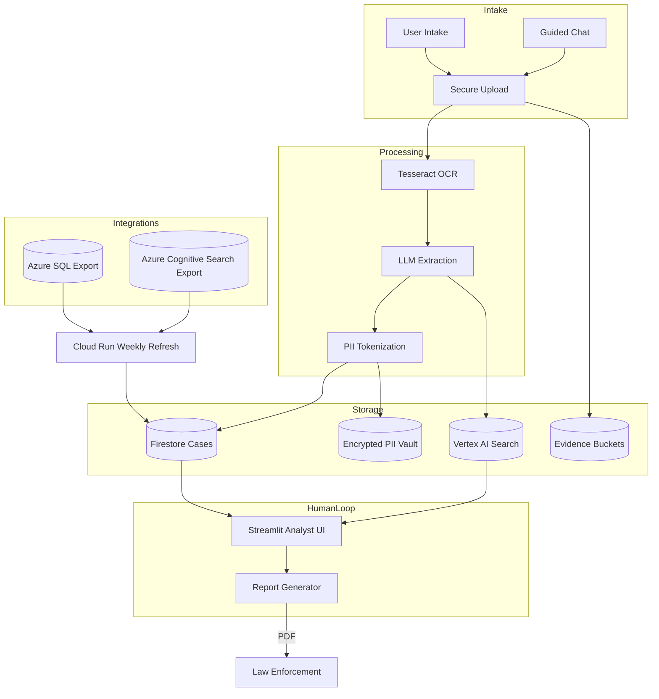

# System Topology

> _Diagram source: summarize architecture from [`proto/docs/prd_production.md`](../../proto/docs/prd_production.md) and `infra/environments` Terraform modules. Update with Draw.io or Figma export when visual design is available._

## Component Highlights

- **User Intake & Chatbot:** Web experiences that collect evidence and offer immediate guidance. Deployed behind Identity Platform to throttle abuse while we evaluate broader IAM options.
- **Processing Pipeline:** Python-based services perform OCR, natural language extraction, and PII tokenization before persisting any data.
- **Storage:** Firestore stores structured case data; a dedicated encrypted vault keeps PII tokens; Evidence and generated reports live in private Cloud Storage buckets; Vertex AI Search powers semantic retrieval.
- **Human Loop:** The Streamlit dashboard keeps analysts in the loop. Approved cases flow into automated report generation pipelines served by FastAPI.
- **External Integrations:** A weekly Cloud Run job synchronizes historical Azure SQL/Search data until all upstream systems migrate fully to GCP.

## Future Enhancements

- Replace placeholder domains with branded hosts once nonprofit DNS approvals land (`app.intelligenceforgood.org`, `api.i4g.app`, etc.).
- Introduce event-driven ingestion to cut the dependency on scheduled refreshes.
- Harden report delivery with signed download portals and optional case collaboration for partner agencies.
