# System Topology

High-level view of how users, analysts, and law enforcement interact with the platform. (Replace the placeholder with the latest “metro map” diagram.)

## What’s in the platform

- **User & Analyst App (Next.js)** — secure portal for victims, volunteers, and LEOs; all traffic goes through the API proxy so PII stays masked.
- **API & Orchestration (FastAPI)** — intake, hybrid search, report generation, and task status; enforces tokenization and access rules.
- **Ops Console (Streamlit)** — internal dashboards for reliability checks and telemetry (not exposed to the public app).
- **Tokenization Vault** — separates canonical PII from case data; deterministic tokens keep searches useful without exposing identities.
- **Data Stores** — structured case store + SQL dual-write for filters, vector store for semantic search, and evidence buckets for artifacts and signed dossiers.
- **AI Assist** — OCR, entity extraction, classification, and embeddings to accelerate analyst review while remaining audit-friendly.

## Why it matters

- **Safety by design:** PII is isolated in the vault; analysts work on masked data.
- **Evidence-ready:** Every case flows toward a signed dossier that law enforcement can verify.
- **Resilient & scalable:** Serverless services scale for campaigns or surges without a large ops team.
