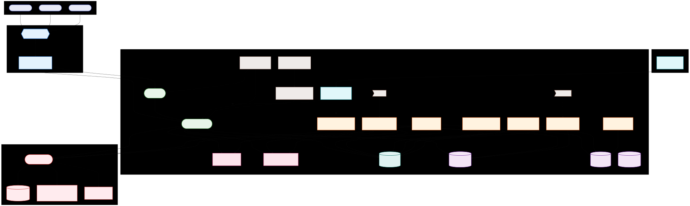

# System Topology

High-level view of how users, analysts, and law enforcement interact with the platform.

Mermaid source (click to expand)

```mermaid
%%{init: {'theme':'base', 'themeVariables': {'fontSize':'16px', 'fontFamily':'system-ui, sans-serif'}, 'flowchart': {'curve':'basis', 'padding':20}}}%%
flowchart TB
    classDef user      fill:#e8eaf6,stroke:#5c6bc0,stroke-width:2px,color:#1a237e
    classDef edge      fill:#e3f2fd,stroke:#1565c0,stroke-width:2px,color:#0d47a1
    classDef service   fill:#e8f5e9,stroke:#2e7d32,stroke-width:2px,color:#1b5e20
    classDef job       fill:#fff3e0,stroke:#e65100,stroke-width:2px,color:#bf360c
    classDef db        fill:#e0f2f1,stroke:#00695c,stroke-width:2px,color:#004d40
    classDef storage   fill:#f3e5f5,stroke:#6a1b9a,stroke-width:2px,color:#4a148c
    classDef ai        fill:#fce4ec,stroke:#ad1457,stroke-width:2px,color:#880e4f
    classDef vault     fill:#ffebee,stroke:#c62828,stroke-width:2px,color:#b71c1c
    classDef platform  fill:#efebe9,stroke:#5d4037,stroke-width:2px,color:#3e2723
    classDef cicd      fill:#e0f7fa,stroke:#00838f,stroke-width:2px,color:#006064

    subgraph Users["👤 Users"]
        Victim(["Victim / Reporter"]):::user
        Analyst(["Volunteer Analyst"]):::user
        LEO(["Law Enforcement"]):::user
    end

    subgraph Edge["🔒 Edge & Identity"]
        LB{{"Global HTTPS LB<br/>(i4g-lb)"}}:::edge
        IAP["Identity-Aware Proxy<br/>Google OAuth · JWT"]:::edge
    end

    subgraph GCP["☁️ GCP — i4g · us-central1"]

        subgraph Services["⚡ Cloud Run Services"]
            API(["Core API (core-svc)<br/>19 routers · rate-limited"]):::service
            Console(["Next.js Console<br/>Analyst UI · SSR"]):::service
            SSISvc(["SSI Service (ssi-svc)<br/>browser · OSINT · wallets"]):::service
        end

        subgraph Jobs["⏱️ Cloud Run Jobs"]
            direction LR
            Ingest["ingest-bootstrap<br/>OCR · normalize · embed"]:::job
            Sweeper["classification-sweeper<br/>re-tag cases · 5 min"]:::job
            Intake["process-intakes<br/>form → entity extraction"]:::job
            Report["generate-reports<br/>PDF · hash · sign"]:::job
            Dossier["dossier-queue<br/>aggregate evidence"]:::job
            Account["account-list<br/>PDF · XLSX export"]:::job
            Purge["retention-purge<br/>90-day delete · daily"]:::job
        end

        subgraph Sched["🕐 Cloud Scheduler"]
            SchedSweep>"*/5 * * * *"]:::platform
            SchedPurge>"0 3 * * * UTC"]:::platform
        end

        subgraph Data["💾 Data Stores"]
            DB[("Cloud SQL · PG 15<br/>i4g_db · IAM auth")]:::db
            Evidence[("GCS · i4g-evidence<br/>versioned · 365 d")]:::storage
            Reports[("GCS · i4g-reports<br/>signed dossiers")]:::storage
            Bundles[("GCS · data-bundles<br/>archive exports")]:::storage
        end

        subgraph AI["🤖 AI & Search"]
            Vertex["Vertex AI Search<br/>hybrid retrieval"]:::ai
            Gemini["Vertex AI · Gemini 2.0<br/>classify · extract · gen"]:::ai
        end

        subgraph Ops["📊 Platform Ops"]
            Secrets["Secret Manager<br/>API keys · DB creds"]:::platform
            Logging["Cloud Logging<br/>structured JSON · corr-ID"]:::platform
            Monitoring["Cloud Monitoring<br/>error >5 % · p95 >2 s"]:::platform
            AR["Artifact Registry<br/>8 container images"]:::cicd
        end

    end

    subgraph Vault["🛡️ PII Vault (isolated project)"]
        VaultDB[("Cloud SQL · PG 15<br/>vault_db · IAM auth")]:::vault
        KMS["Cloud KMS<br/>AES-256-GCM · 90-day rotation"]:::vault
        VaultSecrets["Secrets<br/>pepper · pii-key"]:::vault
        VaultSvc(["PII Vault Service<br/>tokenize · detokenize"]):::vault
    end

    subgraph CICD["🔄 CI / CD"]
        GHA["GitHub Actions<br/>WIF · sa-infra"]:::cicd
    end

    Victim -- "HTTPS" --> LB
    Analyst -- "HTTPS" --> LB
    LEO -- "HTTPS" --> LB
    LB -- "TLS termination" --> IAP
    IAP -- "X-Goog-Auth header" --> Console
    IAP -- "OIDC token" --> API

    Console -- "REST · X-API-KEY" --> API

    API -- "IAM auth · SQL" --> DB
    API -- "signed URLs" --> Evidence
    API -- "semantic + keyword" --> Vertex
    API -- "inference" --> Gemini
    API -- "tokenize PII" --> VaultSvc

    SchedSweep -. "trigger" .-> Sweeper
    SchedPurge -. "trigger" .-> Purge

    Ingest -- "write" --> DB
    Ingest -- "store raw" --> Evidence
    Ingest -- "embed" --> Vertex
    Ingest -- "OCR · classify" --> Gemini
    Ingest -- "tokenize" --> VaultSvc

    Report -- "read cases" --> DB
    Report -- "publish PDF" --> Reports
    Report -- "detokenize" --> VaultSvc

    Dossier -- "aggregate" --> DB
    Dossier -- "bundle" --> Reports

    Account -- "export" --> Reports

    Intake -- "write" --> DB

    Sweeper -- "re-classify" --> Gemini
    Sweeper -- "update" --> DB

    Purge -- "delete" --> DB
    Purge -- "delete" --> Evidence

    SSISvc -- "write scans · wallets" --> DB
    SSISvc -- "store evidence" --> Evidence
    SSISvc -- "OSINT · classify" --> Gemini
    API -- "POST /trigger/investigate" --> SSISvc

    VaultSvc -- "encrypt / decrypt" --> KMS
    VaultSvc -- "read / write tokens" --> VaultDB
    VaultSvc -. "secrets" .-> VaultSecrets

    Secrets -. "credentials" .-> API
    Secrets -. "credentials" .-> Console
    Logging -. "logs" .-> API
    Monitoring -. "alerts" .-> Logging

    GHA -- "push images" --> AR
    AR -. "pull" .-> Services
    AR -. "pull" .-> Jobs
```

## What's in the platform

- **Analyst Console (Next.js)** — secure portal for volunteers and LEOs behind IAP; all traffic proxied through the Core API so PII stays masked.
- **Core API (core-svc)** — 19 API routers covering intake, hybrid search, report generation, task status, taxonomy, and SSI investigation management (history, wallets, evidence, playbooks); enforces tokenization and RBAC.
- **Cloud Run Jobs (8)** — background workers for ingestion, classification sweeping, intake processing, report generation, dossier assembly, account-list export, data-retention purge, and analytics aggregation.
- **SSI Cloud Run Service (ssi-svc)** — always-on service for scam-site investigation: browser automation, OSINT, and wallet extraction. Triggered by the gateway via `POST /trigger/investigate`.
- **PII Vault (isolated project)** — separates canonical PII from case data in a dedicated GCP project with KMS-wrapped encryption; deterministic tokens keep searches useful without exposing identities.
- **Data Stores** — Cloud SQL (PostgreSQL 15, IAM auth), three GCS buckets (evidence, reports, data-bundles), and Vertex AI Search for hybrid retrieval.
- **AI Services** — Vertex AI Gemini 2.0 for classification, entity extraction, and report generation; Vertex AI Search for semantic + keyword hybrid search.
- **GraphService** — server-side graph traversal engine (`src/i4g/services/graph_service.py`) for building entity relationship subgraphs via BFS with optional NetworkX spring layout for large graphs (>500 nodes).
- **Analytics Aggregation Job** — Cloud Run job that computes `entity_stats`, `analytics_kpis`, and `analytics_kpis_monthly` materialized views; feeds the Timeline, Taxonomy Explorer, and Geographic Heatmap.
- **Platform Ops** — Secret Manager for credentials, Cloud Logging with correlation IDs, Cloud Monitoring with alerting thresholds, and Artifact Registry for the 7 container images.
- **CI/CD** — GitHub Actions with Workload Identity Federation (no long-lived keys) pushing images to Artifact Registry.

## Why it matters

- **Safety by design:** PII is isolated in a separate GCP project; analysts work on masked data.
- **Evidence-ready:** Every case flows toward a signed dossier that law enforcement can verify.
- **Resilient & scalable:** Serverless services scale 0→10 for campaigns or surges without a large ops team.
