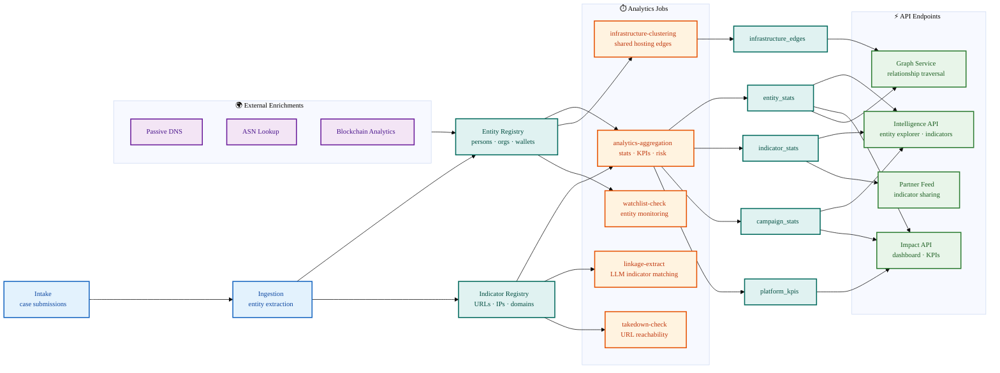

# Threat Intelligence Architecture

> Architecture overview for the Threat Intelligence & Fraud Analytics Platform (TIFAP).

## System Overview

TIFAP provides real-time fraud intelligence through five interconnected subsystems:

1. **Aggregation Pipeline** — ingests case data, extracts entities and indicators, computes analytics statistics
2. **Graph Service** — maintains a NetworkX-based entity relationship graph with infrastructure, wallet cluster, and co-occurrence edges
3. **Campaign Intelligence** — groups related cases into threat campaigns with taxonomy rollup, risk scoring, and timeline analysis
4. **Report Pipeline** — generates dossier reports (PDF/DOCX) via background worker tasks with template-based rendering
5. **External Enrichments** — integrates passive DNS, ASN lookup, and blockchain analytics for entity context

## Data Flow

Mermaid source (click to expand)

## Key Components

| Component             | Location                                    | Purpose                                                                                |
| --------------------- | ------------------------------------------- | -------------------------------------------------------------------------------------- |
| Analytics Store       | `src/i4g/store/analytics_store.py`          | CRUD for `entity_stats`, `indicator_stats`, `campaign_stats`, `platform_kpis`          |
| Graph Service         | `src/i4g/services/graph_service.py`         | In-memory graph computation (neighbors, subgraphs, clusters, temporal snapshots)       |
| Intelligence API      | `src/i4g/api/intelligence.py`               | Entity explorer, indicator registry, campaign detail, graph, timeline endpoints        |
| Impact API            | `src/i4g/api/impact.py`                     | Dashboard KPIs, loss-by-taxonomy, detection velocity, geography, cumulative indicators |
| Export Adapters       | `src/i4g/services/export_adapters.py`       | CSV, XLSX, STIX 2.1 export for indicators and entities                                 |
| Blockchain Enrichment | `src/i4g/services/enrichment/blockchain.py` | Wallet risk labels, cluster analysis, exchange attribution                             |
| Partner Feed API      | `src/i4g/api/partner_feed.py`               | Machine-readable indicator feed for partner organizations                              |

## Partner Indicator Feed

The partner feed provides a separate authentication path (`X-Partner-API-Key` header) for external consumers. Partners authenticate via dedicated API keys stored as SHA-256 hashes in the `partner_api_keys` table. Each request is rate-limited per key and audit-logged.

Supported output formats: JSON (default), CSV, STIX 2.1.

## Graph Edge Types

| Edge Type        | Source                    | Color      | Description                           |
| ---------------- | ------------------------- | ---------- | ------------------------------------- |
| `co_occurrence`  | Case entity co-membership | Blue       | Entities appearing in the same case   |
| `infrastructure` | DNS/hosting relationships | Red dashed | Infrastructure edges from passive DNS |
| `wallet_cluster` | Blockchain analytics      | Gold thick | On-chain wallet groupings             |

## Campaign Intelligence

Threat campaigns group related cases by shared indicators and entities. The campaign model computes:

- **Risk score** — weighted combination of loss sum, victim count, and indicator diversity
- **Taxonomy rollup** — aggregated fraud classifications from member cases
- **Timeline** — temporal sequence of case events within the campaign
- **LEA referral tracking** — which member cases have been referred to law enforcement

See `core/docs/design/threat_intelligence_analytics_tdd.md` for the full technical design.
