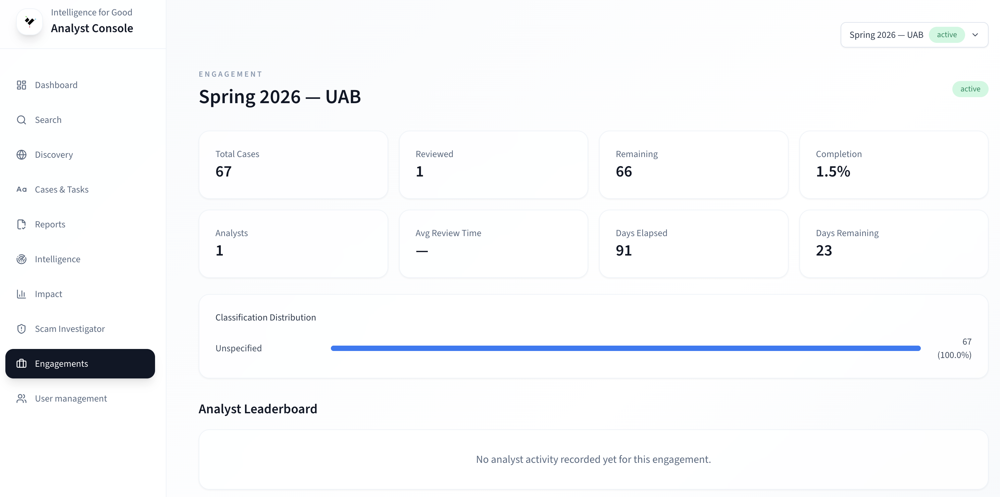

# Leaderboard & Performance

The leaderboard ranks analysts within an engagement by a composite score
that balances accuracy, throughput, and quality. Use it to recognize top
performers, identify analysts who may need support, and generate reports
for stakeholders.

## Accessing the Leaderboard

1. Click **Engagements** in the sidebar to open the management page.
2. Find the engagement in the table.
3. Click the **Leaderboard** icon (🏆 trophy) in the actions column.

The leaderboard page has two sections: an analytics summary at the top
and the ranked analyst table below.

## Analytics Summary

Eight metric cards give you a bird's-eye view of the engagement:

| Metric              | What it tells you                                                   |
| ------------------- | ------------------------------------------------------------------- |
| **Total Cases**     | Cases assigned to the engagement.                                   |
| **Reviewed**        | Cases that have received at least one review.                       |
| **Remaining**       | Cases waiting for a review.                                         |
| **Completion**      | Percentage of cases reviewed (reviewed ÷ total × 100).              |
| **Analysts**        | Number of analysts with activity in this engagement.                |
| **Avg Review Time** | Average time from case assignment to first review action, in hours. |
| **Days Elapsed**    | Days since the engagement's start date.                             |
| **Days Remaining**  | Days until the end date. Shows "—" if no end date is set.           |

Below the cards, a **Classification Distribution** chart breaks down case
classifications within the engagement (e.g. pig butchering, romance scam,
investment fraud) with counts and percentages.

## Leaderboard Table

Analysts are ranked from highest to lowest composite score:

| Column       | Description                                                     |
| ------------ | --------------------------------------------------------------- |
| **Rank**     | Position in the leaderboard. The top 3 are highlighted.         |
| **Analyst**  | The analyst's display name.                                     |
| **Cases**    | Number of cases reviewed by this analyst.                       |
| **Accuracy** | Classification accuracy vs. consensus or ground truth (0–100%). |
| **Actions**  | Total actions logged (close case, share, escalate, etc.).       |
| **Score**    | Composite score used for ranking.                               |

## How the Composite Score Works

The composite score combines three dimensions into a single number:

$$
\text{composite} = w_a \times \text{accuracy} + w_t \times \text{throughput} + w_q \times (1 - \text{risk\_mae})
$$

Where:

- **Accuracy** = correct classifications ÷ total classifications (0.0–1.0).
- **Throughput** = your review count ÷ the top reviewer's count in the
  engagement (normalized to 0.0–1.0).
- **Risk MAE** = your mean absolute error ÷ the largest MAE in the
  engagement. Subtracted from 1 so lower error → higher score.
- The weights ($w_a$, $w_t$, $w_q$) default to equal weighting.

### Accuracy scoring

Accuracy measures how closely your classifications match the consensus —
the collective judgment of all reviewers in the engagement.

- When multiple analysts classify the same case, the majority classification
  is the reference.
- Your accuracy = cases matching consensus ÷ total cases you reviewed.

> Accuracy is most meaningful when multiple analysts review the same cases.
> In single-reviewer engagements, accuracy is not computed.

### Risk score MAE

Risk score Mean Absolute Error captures how far your risk assessments
deviate from the group consensus. A lower MAE means more consistent risk
assessment aligned with peers.

## Engagement-Scoped KPIs

When an engagement is selected, the dashboard replaces platform-wide KPIs
with engagement-scoped numbers:

| KPI                    | What it shows for the engagement                                       |
| ---------------------- | ---------------------------------------------------------------------- |
| **Total Cases**        | Cases in the selected engagement.                                      |
| **Total Loss**         | Sum of reported losses for the engagement's cases.                     |
| **Active Threats**     | Threat entities linked to the engagement's cases with recent activity. |
| **New Indicators**     | Indicators first seen in cases belonging to this engagement.           |
| **Median Action Time** | Median time to first action for the engagement's cases.                |

## Exporting Data

Managers have two export options on the leaderboard page:

### CSV export

Click **Export CSV** to download a spreadsheet-ready file with columns:
Rank, Analyst, Cases Reviewed, Avg Review Time, Classification Accuracy,
Risk Score MAE, Actions Logged, Composite Score. Great for award
certificates, grant reporting, and quick analysis.

### JSON export

Click **Export JSON** for a structured file containing:

- **summary** — engagement metadata (name, status, case count, completion %,
  classification distribution, analyst count, average review time).
- **leaderboard** — array of analyst entries with all metrics.

Ideal for custom dashboards or long-term archival.

## When Analytics Update

Engagement analytics are computed by an analytics aggregation job on a
configurable schedule. The leaderboard reflects the latest completed run.

Real-time progress (case count, reviewed, completion %) updates as analysts
work.

## Learn more

- [Engagements](../key-concepts/engagements.md) — foundational concepts
- [Managing Engagements](managing-engagements.md) — the manager workflow
- [Working in an Engagement](working-in-engagement.md) — the analyst
  perspective
