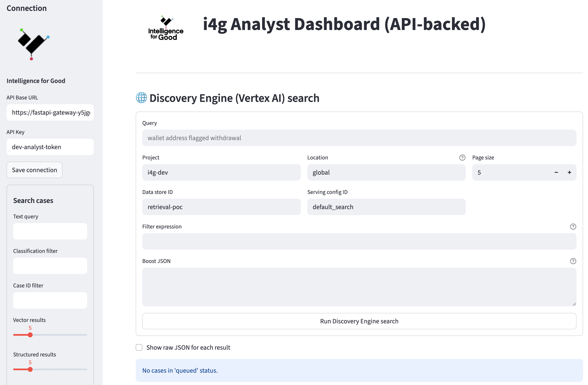

# Analyst Guide

Volunteer analysts operate the heart of i4g. This guide covers how to access the dashboard, triage cases, and maintain audit-ready notes.

## Access Requirements

* Provisioned Google account (university, nonprofit, or personal) added to the `analyst` IAM group.
* Google Identity Platform is the current authentication provider. We may adopt hardware keys or organization-managed SSO in future phases for greater convenience.
* Optional: enroll in the volunteer Slack/Discord channel for real-time coordination.

## Daily Workflow

1. Navigate to the Analyst Dashboard at [https://streamlit-analyst-ui-y5jge5w2cq-uc.a.run.app/](https://streamlit-analyst-ui-y5jge5w2cq-uc.a.run.app/).
2. Sign in with your authorized Google account.
3. Review the **Queue Summary** panel to see:
   * Open cases assigned to you.
   * SLA breaches (e.g., cases waiting >72 hours).
   * Alerts for mass campaign spikes (batched ingestion from Azure exports).
4. Open the top-priority case and review the auto-generated synopsis (scam type, risk score, key entities).
5. Inspect evidence. PII will appear as masked tokens (`███████`). If the context is unclear, request rehydration from an administrator via secure channel.
6. Add structured annotations:
   * Scam classification (romance, crypto investment, phishing, other).
   * Confidence rating.
   * Free-form notes (Markdown supported).
7. Take a final action:
   * **Approve** (true positive) → qualifies for reporting.
   * **Reject** (false positive) → archive with rationale.
   * **Needs more info** → loops back to user liaison.

## Best Practices

* Keep notes factual and concise. Avoid personally identifying language in free-form text.
* Use the predefined tags (e.g., `#wallet`, `#social-media`, `#payment-processor`) to support analytics queries.
* If a case appears to be part of a larger campaign, tag it with the campaign ID or create a new one via the “Link Cases” dialog.
* Coordinate handoffs in the volunteer chat, especially if you cannot finish a review in one session.

## Metrics & Impact Tracking

* The dashboard displays individual and team metrics (cases closed, time to resolution, dollars recovered estimates).
* Download CSV reports from the **Analytics** tab to include in academic or grant reporting.
* When in doubt about classification, err on the side of escalation—administrators can always downgrade later.

## Escalation Paths

* **Urgent safety issues** (self-harm threats, stalking): notify the program administrator immediately.
* **Potential law enforcement action**: flag with `@leo-liaison` in the secure channel; provide context and recommended next steps.
* **Tooling issues** (timeouts, UI bugs): open a ticket in the GitHub `proto` repo with reproduction steps and screenshots.

Thank you for volunteering—your work directly strengthens our ability to protect vulnerable communities.

## Evidence Dossiers (Reports tab)

The new **Evidence Dossiers** console view replaces the temporary Streamlit panel and gives you a single place to
inspect dossier plans, manifest metadata, and signature verification results before sharing artifacts with partners.

> **Screenshot placeholder:** Reports → Dossiers landing view showing status filters and manifest toggle.

### Before you begin
- Sign into the Next.js console at `https://i4g-console-…/reports/dossiers` (IAP-protected).
- Ensure at least one dossier plan exists. If the list is empty, ping the ops channel so the report job can enqueue
  fresh plans or rerun the pilot queue.
- Leave “Include manifest JSON” off unless you need to review the raw payload; enabling it streams larger responses and
  can be slower on low bandwidth.

### Review and filter the queue
1. Use the gradient filter card at the top of the page to pick a **Status** (Completed, Pending, Failed, All) and set the
   **Rows to load** limit. Submitting the form refreshes the list and updates the badge that reports how many plans were
   returned.
2. Each dossier card surfaces key stats: jurisdiction, loss totals, cases bundled, warning counts, and quick chips that
   show the manifest and signature-manifest file paths. Use these chips when cross-checking with ops or confirming what
   lives in the Shared Drive.
3. Expand the “Dossier plan payload” accordion if you need the full JSON body that generated the plan for audit notes.

> **Screenshot placeholder:** Dossier card highlighting warnings, case badges, and manifest chips.

### Verify signatures inline
1. Click **Verify signatures** on any card to run the FastAPI verification endpoint. The panel locks while the request is
   running and then displays the result inline—either **Verified** or **Attention**.
2. The verification panel summarizes missing/mismatch counts and lists every artifact with its expected hash fragment,
   whether it was found, and whether the hash matched. Use this to decide whether it is safe to distribute the dossier.
3. If you see repeated failures, notify the ops team; they can re-run the bundle or regenerate the signature manifest.

> **Screenshot placeholder:** Verification panel showing artifact rows after a successful run.

### Share dossiers with partners
1. Copy the manifest and signature-manifest paths from the chips at the top of the card and include them in your case
   notes or external handoff so recipients know which files to download.
2. When sending to LEA contacts, remind them to grab both the PDF and the `.signatures.json` file so they can verify
   integrity independently. The verification notes you captured from the panel (timestamp + hash snippets) should also be
   pasted into the ticket for an audit trail.
3. If manifest streaming was disabled during review, re-run the verification step with the toggle turned on before
   collecting screenshots for compliance packages; this ensures your screenshots show the same JSON investigators will
   see.
