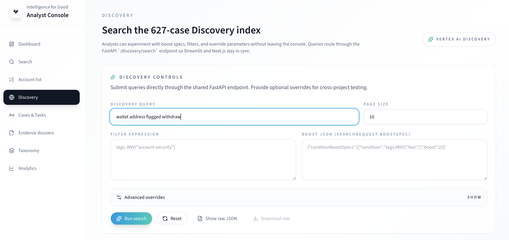

# Discovery Guide (Analysts)

Discovery is for quick, semantic-only exploration before you add filters.

## When to use Discovery

- Fast browsing, fuzzy lookups, and early investigations when you do not know which filters to apply.
- Discovery does not apply structured filters or chips; it returns semantic hits only.

## Workflow

1. Enter a text query and review semantic results.
2. If you need structured filters or saved searches, click **Promote to Search** to carry the query into the Search tab.
3. Open results to view tokenized entities and linked documents; pivot to Search if you need to refine further.
