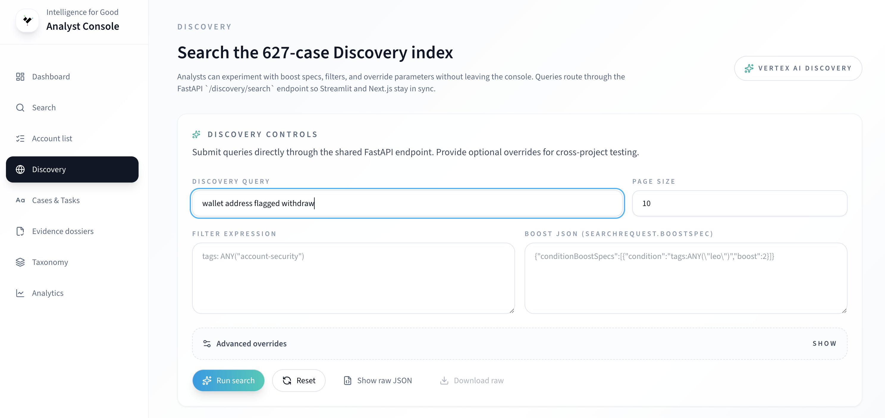

# Discovery Guide (Analysts)

Discovery provides access to the Vertex AI Discovery index for semantic exploration of the case corpus.

## When to use Discovery

- Fast semantic browsing and fuzzy lookups when you do not yet know which structured filters to apply.
- Exploring the full indexed corpus via Google Vertex AI Discovery's natural language understanding.

## Workflow

1. Enter a text query in the search box and review semantic results.
2. Each result shows rank signals, structured fields, and an expandable raw payload section.
3. Use **Download raw** or **Show raw JSON** to inspect the full result payload.
4. If you need structured filters, switch to the **Search** tab for hybrid search capabilities.

## Advanced options

- **Filter expression** — apply Vertex AI Discovery filter expressions to narrow results.
- **Boost spec** — provide a JSON boost specification to re-rank results.
- **Overrides** — configure project, location, data store ID, and serving config for testing against different indexes.

## PII handling

Discovery applies client-side PII redaction to mask emails, names, and addresses in the results view. Tokens appear as `████████` blocks in the displayed text.
