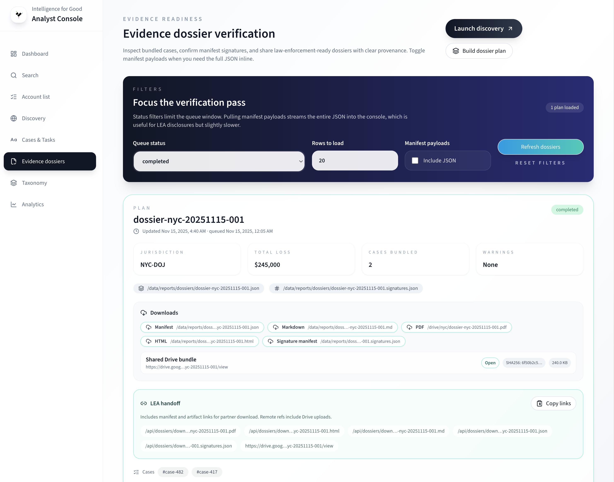
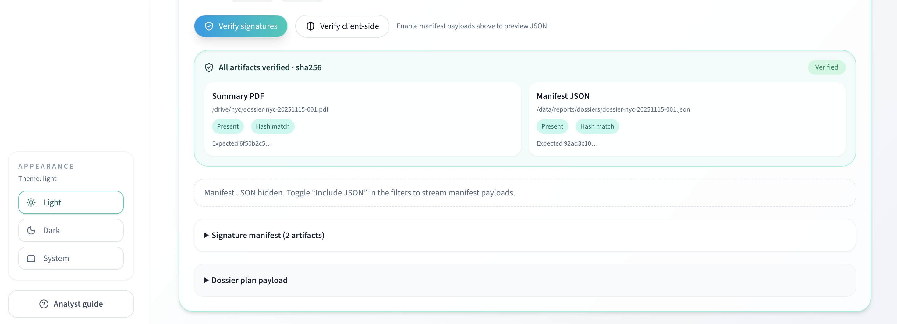

# Dossiers Guide (Analysts)

Use the **Evidence Dossiers** page to validate bundles before sharing with partners. This guide is for analysts; recipients should follow the [Law Enforcement Guide](../law-enforcement.md) to open and verify reports.

> Placeholder: replace with the latest UI capture showing filters and cards.

## Before you begin

- Sign into <https://app.intelligenceforgood.org/reports/dossiers> (protected access).
- Ensure at least one dossier plan exists; if empty, click **Build dossier plan** or contact ops.

## Filter and browse

1. Set **Status** (completed, pending, leased, failed, or all), **Rows to load**, and optionally toggle **Manifest payloads** to include raw manifests.
2. Each card shows: Plan ID, jurisdiction, total loss, cases bundled, warning counts, and chips for manifest/signature paths.
3. Expand the payload accordion only if you need raw JSON.

## Verify signatures

Two verification options are available:

1. **Verify signatures** (server-side) — sends the manifest to the backend for hash verification. Review `allVerified`, `missingCount`, `mismatchCount`, and per-artifact hash results.
2. **Verify client-side** — computes SHA-256 hashes in the browser against the expected values. Useful for independent verification without server trust.

If failures repeat, alert ops to regenerate the bundle.

## Download artifacts

The downloads panel provides multiple output formats:

- **PDF**, **HTML**, **Markdown** — the rendered dossier report.
- **Manifest** and **Signature manifest** — JSON manifests for programmatic consumption.
- Remote download entries show file hashes and sizes for verification.

## Share with partners

- Use the **LEA handoff** banner's **Copy links** button to copy manifest and artifact links to the clipboard.
- Remind partners to download the `.signatures.json` alongside the PDF for independent verification (see [Law Enforcement Guide](../law-enforcement.md)).
- Record the verification result (timestamp + hash snippets) in tickets for audit trails.
