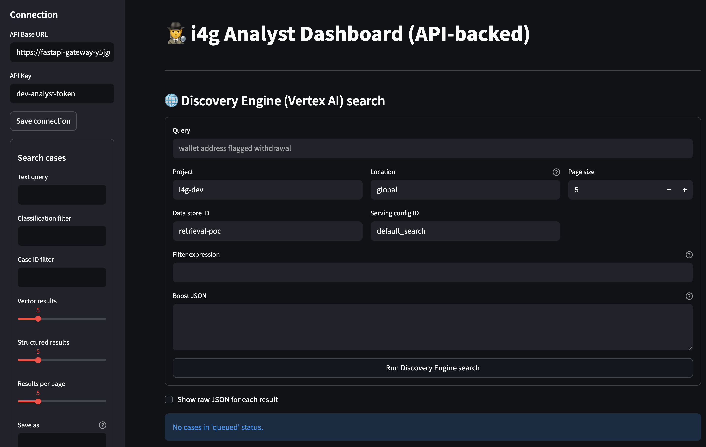

# Analyst Guide

Volunteer analysts operate the heart of i4g. This guide covers how to access the console, triage cases, and maintain
audit-ready notes.

## Access Requirements

* Provisioned Google account (university, nonprofit, or personal) added to the `analyst` IAM group.
* Access the analyst console at `https://app.intelligenceforgood.org` (IAP-protected). Sign in with your authorized
  Google account.
* Optional: enroll in the volunteer Slack/Discord channel for real-time coordination.

## Daily Workflow

1. Open [app.intelligenceforgood.org](https://app.intelligenceforgood.org).
2. Review the **Queue** widget on the home tab to see items assigned to you, SLA breaches, and campaign spikes.
3. Open the top-priority case and review the synopsis (scam type, risk score, key entities).
4. Inspect evidence. PII appears as masked tokens (`AAA-XXXXXXXX`). If context is unclear, request detokenization from
   an admin via secure channel.
5. Add structured annotations:
   * Scam classification (romance, crypto investment, phishing, other).
   * Confidence rating.
   * Free-form notes (Markdown supported).
6. Take a final action:
   * **Approve** (true positive) → qualifies for reporting.
   * **Reject** (false positive) → archive with rationale.
   * **Needs more info** → loops back to user liaison.

## Where to go next

* Search tab usage, chips, and saved searches: [Search Guide](search.md)
* Discovery tab basics and when to use it: [Discovery Guide](discovery.md)
* Evidence Dossiers workflow: [Dossiers Guide](dossiers.md)

## Screenshots to add

* Queue → case detail view with tokenized entities.

## Best Practices

* Keep notes factual and concise. Avoid personally identifying language in free-form text.
* Use the predefined tags (e.g., `#wallet`, `#social-media`, `#payment-processor`) to support analytics queries.
* If a case appears to be part of a larger campaign, tag it with the campaign ID or create a new one via the “Link Cases” dialog.
* Coordinate handoffs in the volunteer chat, especially if you cannot finish a review in one session.

## Metrics & Impact Tracking

* The console displays individual and team metrics (cases closed, time to resolution, dollars recovered estimates).
* Download CSV reports from the **Analytics** tab to include in academic or grant reporting.
* When in doubt about classification, err on the side of escalation—administrators can always downgrade later.

## Escalation Paths

* **Urgent safety issues** (self-harm threats, stalking): notify the program administrator immediately.
* **Potential law enforcement action**: flag with `@leo-liaison` in the secure channel; provide context and recommended next steps.
* **Tooling issues** (timeouts, UI bugs): open a ticket in the GitHub `core` repo with reproduction steps and screenshots.

Thank you for volunteering—your work directly strengthens our ability to protect vulnerable communities.
