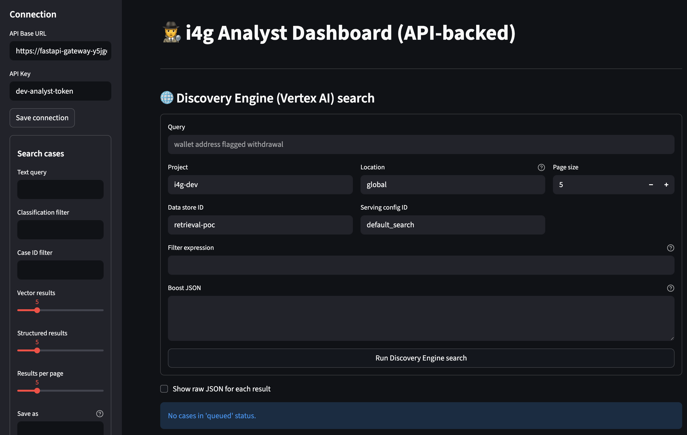
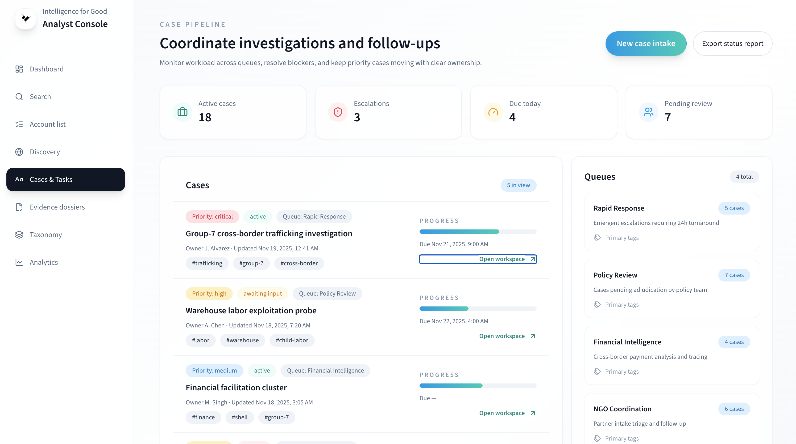

# Analyst Guide

Volunteer analysts operate the heart of i4g. This guide covers how to access the console, triage cases, and maintain
audit-ready notes.

## Access Requirements

- Provisioned Google account (university, nonprofit, or personal) added to the `analyst` IAM group.
- Access the analyst console at `https://app.intelligenceforgood.org` (IAP-protected). Sign in with your authorized
  Google account.
- Optional: enroll in the volunteer Slack/Discord channel for real-time coordination.

## Console Pages

The sidebar gives you access to these sections:

| Page                       | Purpose                                                                                                                           |
| -------------------------- | --------------------------------------------------------------------------------------------------------------------------------- |
| **Dashboard**              | Metrics cards (cases, resolution times, loss totals), alerts and escalations, activity feed, reminders, and quick-action buttons. |
| **Cases**                  | Browse and filter the case queue by status, priority, classification. Open a case to view its narrative, timeline, and artifacts. |
| **Search**                 | Hybrid search (text + structured filters) across the case corpus. Save and manage search queries.                                 |
| **Discovery**              | Vertex AI Discovery integration for semantic exploration against the indexed case corpus.                                         |
| **Evidence Dossiers**      | Review, verify, and share signed evidence bundles with law enforcement partners.                                                  |
| **Campaigns**              | Create and manage active campaigns that group cases by tactical signals.                                                          |
| **Analytics**              | Charts and trend metrics for operational reporting.                                                                               |
| **Taxonomy**               | Browse the multi-axis fraud classification taxonomy used across the platform.                                                     |
| **Accounts**               | Account list extraction and search.                                                                                               |
| **Entity Explorer**        | Browse, search, and drill into threat entities with co-occurrence graphs.                                                         |
| **Indicator Registry**     | Categorized indicator catalog with bulk actions and STIX export.                                                                  |
| **Intelligence Dashboard** | Widget-based overview of entity, indicator, campaign, and platform KPIs.                                                          |

## Daily Workflow

1. Open [app.intelligenceforgood.org](https://app.intelligenceforgood.org).
2. Review the **Dashboard** for summary metrics, alerts, and the activity feed.
3. Navigate to **Cases** and open a top-priority case to review the synopsis (classification badges, timeline, artifacts).
4. Inspect evidence. PII appears as masked tokens (`AAA-XXXXXXXX`). If context is unclear, request detokenization from
   an admin via secure channel.
5. Classification badges reflect the multi-axis taxonomy:
   - Intent (e.g., Romance, Investment, Imposter)
   - Channel (e.g., Chat, Social Media, Email)
   - Social Engineering Technique (e.g., Trust Building, Urgency)
   - Requested Action (e.g., Send Money, Crypto)
   - Claimed Persona (e.g., Romantic Partner, Bank)
6. Take action on a case:
   - **Close Case** — marks the case as resolved.
   - **Share** — shares case information with partners or liaisons.

## Where to go next

- Entity Explorer — browse and drill into threat entities: [Entity Explorer](entity_explorer.md)
- Indicator Registry — categorized indicator catalog with STIX export: [Indicator Registry](indicator_registry.md)
- Network Graph — explore entity relationships visually: [Network Graph](network_graph.md)
- Taxonomy Explorer — Sankey, heatmap, and trend views: [Taxonomy Explorer](taxonomy_explorer.md)
- Geographic Heatmap — country-level fraud analysis: [Geographic Heatmap](geographic_heatmap.md)
- Timeline — multi-track activity timeline: [Timeline](timeline.md)
- Search tab usage, filters, and saved searches: [Search Guide](search.md)
- Discovery tab and Vertex AI exploration: [Discovery Guide](discovery.md)
- Evidence Dossiers workflow: [Dossiers Guide](dossiers.md)
- Campaigns and governance taxonomy: [Campaigns & Governance](campaign_governance.md)

## Best Practices

- Keep notes factual and concise. Avoid personally identifying language in free-form text.
- Use taxonomy classifications consistently to support analytics queries.
- If a case appears to be part of a larger campaign, link it from the **Campaigns** page.
- Coordinate handoffs in the volunteer chat, especially if you cannot finish a review in one session.

## Metrics & Impact Tracking

- The Dashboard displays summary metrics cards (cases processed, resolution times, total losses).
- The **Analytics** page shows charts and trend data for operational and grant reporting.
- When in doubt about classification, err on the side of escalation — administrators can always downgrade later.

## Escalation Paths

- **Urgent safety issues** (self-harm threats, stalking): notify the program administrator immediately.
- **Potential law enforcement action**: flag with `@leo-liaison` in the secure channel; provide context and recommended next steps.
- **Tooling issues** (timeouts, UI bugs): open a ticket in the GitHub `core` repo with reproduction steps and screenshots.

Thank you for volunteering — your work directly strengthens our ability to protect vulnerable communities.
