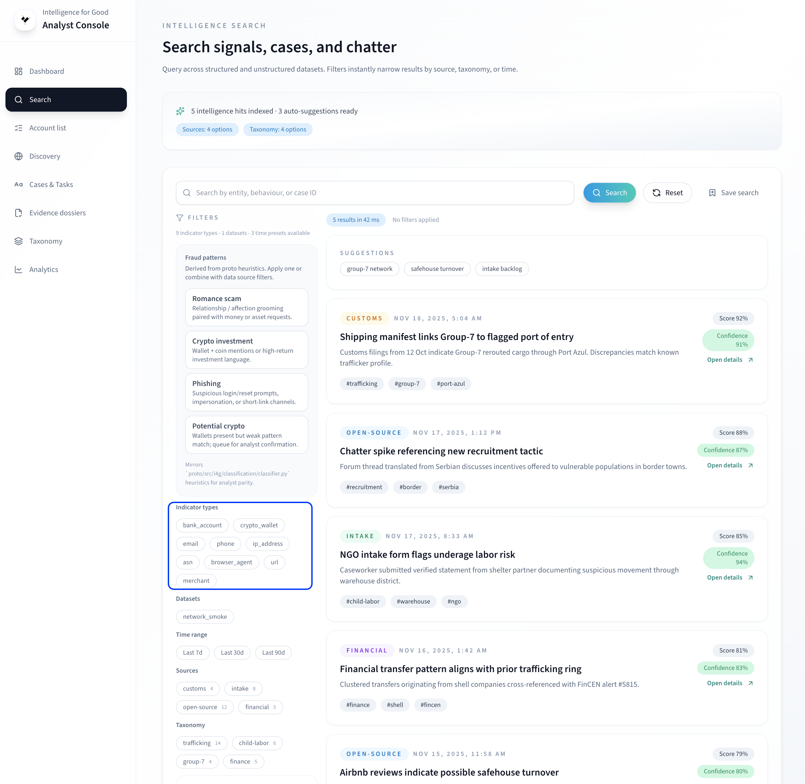
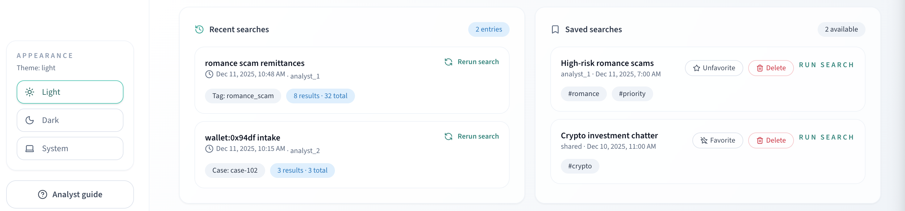

# Search Guide (Analysts)

Use the Search tab when you need hybrid (semantic + structured) triage.

## Chips and filters
- Applied filters appear as chips under the search bar (dataset, classification, entities, case ID).
- Click the `×` to remove a chip or the chip body to edit the value.
- Text search drives semantic retrieval; chips constrain the structured slice. The console merges both streams in the results.

## Building and saving a search
1. Enter text (optional) and add chips for datasets, classifications, entities, or case IDs.
2. Click **Save search** to name it, add tags, and (optionally) mark as favorite.
3. Re-open saved searches from the drawer; use **Save as copy** to clone without overwriting.

## Reading results
- Each card shows the merged score; diagnostics panel breaks down semantic vs structured contributions.
- Open a result to see tokenized entities, linked documents, and audit actions.
- Use **Open in Discovery** to pivot into the Discovery tab with the same context if you want semantic-only browsing.
