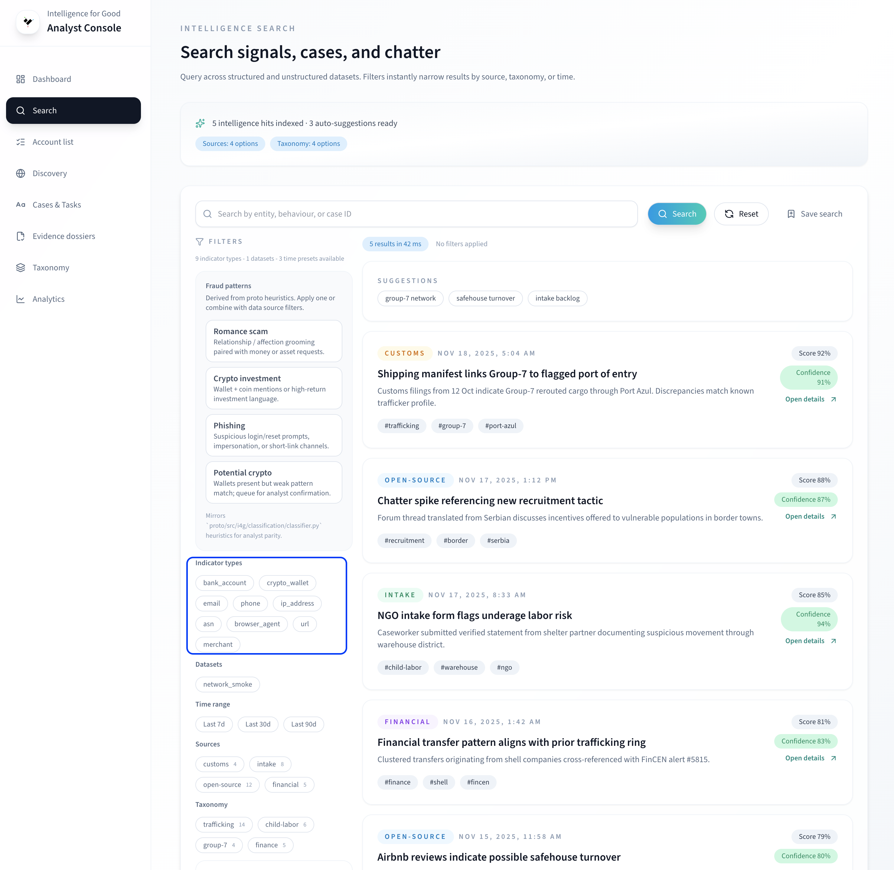
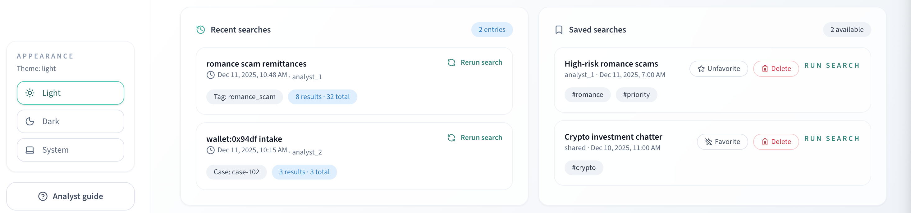

# Search Guide (Analysts)

Use the Search tab for hybrid (semantic + structured) triage across the case corpus.

## Filters

- Applied filters appear as badges above the results area. Available filter categories include:
  - **Source** — filter by data source
  - **Taxonomy** — filter by fraud classification (Intent, Channel, Technique, Action, Persona)
  - **Indicator types** — bank accounts, crypto wallets, emails, phones, etc.
  - **Datasets** — restrict results to specific ingestion datasets
  - **Time range** — presets for 7d, 30d, 90d windows
  - **Entity filters** — match specific entity values with configurable match modes (exact, contains, prefix)
  - **Active campaigns** — filter by linked campaign
- Click a badge to modify or remove it.
- Text search drives semantic retrieval; filters constrain the structured slice. The console merges both streams in the results.

## Saving searches

1. Enter text (optional) and apply any combination of filters.
2. Click **Save search** and provide a name.
3. Manage saved searches in the list below the results — toggle favorites, rename, or delete.

## Reading results

- Each result card shows a merged score and confidence percentage.
- Expand a result to see classification analysis, entity details, and few-shot examples.
- Search history is accessible alongside saved searches for quick re-runs.
