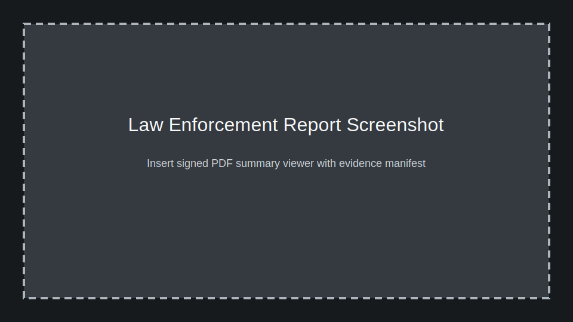

# Law Enforcement Guide

The i4g program delivers digitally signed, evidence-rich reports that streamline intake for law enforcement agencies. Analysts assemble and verify dossiers; this guide explains how recipients can interpret reports, verify authenticity, and request additional data.

> Placeholder: replace with a screenshot of the PDF report viewer highlighting key sections (timeline, entity table, evidence manifest).

## Report Contents

Each report follows a standardized template derived from the production PRD:

1. **Cover Sheet** – Case ID, user alias, generating analyst, timestamp, digital signature hash.
2. **Executive Summary** – One-page narrative of the scam, financial impact, and recommended next steps.
3. **Timeline** – Chronological sequence of critical messages, transactions, and interventions.
4. **Entity Overview** – Table of extracted entities (wallets, emails, phone numbers) with confidence scores.
5. **Evidence Manifest** – Links to redacted artifacts; full-resolution files stored in secure object storage.
6. **Appendices** – Risk flags, related cases, references to applicable criminal statutes.

## Authenticity & Chain of Custody

- Reports include a SHA-256 signature generated at export time. Verify using the hash listed on the cover sheet and the `.signatures.json` provided by the analyst.
- Each evidence file contains embedded metadata referencing the case ID and export timestamp.
- Access to raw PII or unredacted media requires a subpoena or mutual aid agreement. Contact `leo@intelligenceforgood.org` with the Case ID.

## Requesting Additional Information

1. Email the liaison (above) from an official domain with subject line `Case <ID> – Additional Evidence Request`.
2. Specify the exact materials required (e.g., original chat logs, encrypted contact field decryption, crypto transaction traces).
3. Attach the signed request form or subpoena when applicable.
4. Expect a response within 2 business days. Urgent cases should also trigger the secure hotline.

## Feedback Loop

Your feedback helps improve the system:

- Report sections that require more detail or different formatting.
- Additional entities or metrics that would support your investigative process.
- Outcomes (arrests, funds recovered) tied to i4g reporting.

## Data Handling Expectations

- Treat all shared artifacts as confidential and for official use only.
- Do not forward reports to third parties without consent from Intelligence for Good or the user.
- Notify the liaison immediately if you detect compromised credentials, phishing attempts, or other operational risks involving the shared data.

## LEA Evidence Dossier

Analysts can now generate a dedicated **LEA Evidence Dossier** from the Report
Builder. The dossier is a structured package specifically designed for law
enforcement intake.

### Generation flow

1. An analyst navigates to **Reports → Builder** and selects the
   `LEA Evidence Dossier` template.
2. They define the scope (campaign ID, entity filter, or date range) and
   confirm the TLP classification (default: **TLP:RED**).
3. The system compiles the dossier from the template
   (`templates/reports/lea_dossier.md.j2`), including:
   - Cover sheet with case identifiers and analyst certification
   - Indicator declarations table with values, types, and first-seen dates
   - Entity summary with risk scores
   - Evidence exhibits with per-artifact SHA-256 hashes
   - Case history timeline
   - An integrity manifest listing every artifact hash and an aggregate hash
4. The completed dossier appears in the Report Library for download.

### Chain-of-custody verification

The LEA dossier implements a **two-tier chain-of-custody** model:

- **Per-record hashes**: Each evidence artifact (screenshot, document, log)
  carries its own SHA-256 hash, computed at ingestion time and embedded in the
  evidence manifest.
- **Aggregate hash**: A top-level SHA-256 is computed over the sorted set of
  all per-record hashes. This provides tamper evidence for the entire bundle —
  if any single artifact is modified, the aggregate hash changes.

To verify: compare the aggregate hash in the dossier footer against the
independently computed hash of all listed artifact hashes, sorted
lexicographically then concatenated and SHA-256'd.

### TLP guidance for LEA packages

LEA dossiers default to **TLP:RED** (named recipients only). Treat the
dossier as restricted to your investigative team. Do not distribute beyond
the named agency without written consent.

## LEA Referral Tracking

Analysts can now log law enforcement referrals directly on case records,
creating a structured audit trail from investigation to agency intake.

### Recording a referral

1. Open a case detail page and select **Log LEA Referral**.
2. Fill in the agency name, referral date, and external case number (if known).
3. The system records the referral via `POST /cases/{id}/lea-referral` and
   stamps the case with referral metadata.

### Viewing referral status

- **Case detail**: The referral section shows the agency, date, and status.
- **Campaign detail**: The campaign view aggregates referral status across
  member cases, showing which cases have been referred and to which agencies.
- **API**: `GET /cases/{id}/lea-referral` returns the current referral record.

### Blockchain enrichment in dossiers

The platform includes blockchain analytics enrichment. When a case contains wallet
entities, the LEA dossier now includes:

- **Vendor risk label** — Risk classification from the configured blockchain
  analytics vendor (Chainalysis, Elliptic, or TRM Labs).
- **Transaction volume** — Total transaction value associated with the wallet.
- **Exchange attribution** — Known exchange or service linked to the wallet.
- **Wallet cluster edges** — Related wallets identified through on-chain
  clustering, visible in the network graph section of the dossier.

i4g is a volunteer-led nonprofit initiative. We appreciate your partnership in bringing scammers to justice and protecting vulnerable communities.
