# Campaigns & Threat Networks

A **campaign** is a cluster of cases that share common threat entities —
the same wallet address, the same phone number, the same domain. Campaigns
reveal coordinated fraud operations that would be invisible if each report
were viewed in isolation.

## How campaigns are detected

The platform's aggregation pipeline automatically groups cases based on
shared entity overlaps:

<!--
Diagram: 3 cases with shared wallet/email entities → auto-clustered
into a campaign
-->

**Example:** Three unrelated victims submit reports. Victim A and Victim B
both sent Bitcoin to the same wallet address. Victim B and Victim C both
communicated with the same email address. The platform links all three
cases into a single campaign — revealing that one scam operation targeted
multiple victims through shared infrastructure.

No analyst action is required for detection. The platform discovers
campaigns automatically as new cases are ingested and entities are
extracted.

## Campaign lifecycle

A detected campaign goes through two stages:

| Status        | Meaning                                            |
| ------------- | -------------------------------------------------- |
| **Detected**  | Auto-discovered by the aggregation pipeline        |
| **Confirmed** | An analyst has reviewed and validated the campaign |

Once confirmed, analysts can name the campaign, assign governance taxonomy
categories, and manage its case membership.

## Campaign risk scoring

Each campaign receives a risk score (0–100) computed from four factors:

| Factor               | Weight | What it measures                        |
| -------------------- | ------ | --------------------------------------- |
| Total loss           | 40%    | Aggregate financial damage across cases |
| Linked case count    | 30%    | Scale of the operation                  |
| Entity co-occurrence | 20%    | Density of shared infrastructure        |
| Recency              | 10%    | How recently the campaign was active    |

Campaigns scoring above 70 appear with a red risk badge and are
prioritized for law enforcement referral.

## Active campaigns vs. governance taxonomy

The platform supports two complementary campaign concepts:

| Aspect       | Active campaign (tactical)  | Governance taxonomy (strategic) |
| ------------ | --------------------------- | ------------------------------- |
| Creation     | Auto-detected or manual     | Defined by policy teams         |
| Purpose      | Track a specific fraud wave | Long-term reporting categories  |
| Speed        | Changes weekly or daily     | Stable quarterly or annually    |
| Audience     | Analysts and investigators  | Executives and compliance teams |
| Risk scoring | 0–100 composite score       | Not applicable                  |

When you create or manage a campaign, you can link it to governance
taxonomy categories. This connects daily tactical detections to the
stable strategic categories that leadership uses for quarterly reports —
without either system constraining the other.

## Managing campaigns in the Console

On the campaign detail page you can:

- **Rename** — click the campaign title to edit
- **Merge** — combine two or more campaigns into one
- **Split** — unlink cases that don't belong
- **Link/unlink cases** — add or remove individual cases

All management operations are logged in the audit trail.

## What you'll see in the Console

- **Campaigns list** — card grid with name, status, case count, and risk
  badge
- **Campaign detail** — timeline, entity graph, member cases, and
  governance links
- **Intelligence Dashboard** — high-risk campaigns flagged for LEA referral

## Learn more

- [Entities](entities.md) — the shared entities that drive campaign
  detection
- [Campaigns](../analyst-guide/campaigns.md) — using the Console to
  browse and manage campaigns
