# Entities

An **entity** is any identifiable piece of information extracted from a
case — a wallet address, an email, a phone number, a domain name, or even
a person's name. Entities are how the platform turns unstructured scam
reports into structured, linkable intelligence.

## Two categories of entities

Not all entities are equal. The platform distinguishes between **threat
entities** and **contextual entities** because they serve different purposes.

<!--
Diagram: One scam report → extracted entities → links to other cases
-->

### Threat entities (14 types)

Threat entities represent the infrastructure scammers use to commit fraud.
These are the identifiers analysts investigate, watchlist, and report to
law enforcement.

| Category                   | Entity types                                                                               |
| -------------------------- | ------------------------------------------------------------------------------------------ |
| **Financial**              | wallet_address, bank_account, account_number, routing_number, crypto_token, transaction_id |
| **Contact**                | email_address, phone_number, social_handle, contact_handle, payment_handle                 |
| **Digital infrastructure** | url, domain, ip_address                                                                    |

### Contextual entities

Contextual entities provide investigative context but are not themselves
fraud indicators:

- **Person names** — names mentioned in scam narratives
- **Organizations** — company or brand names (often impersonated)
- **Locations** — cities, countries, and addresses

These help analysts understand _who_ is being impersonated and _where_
victims are located, but they don't receive risk scores or lifecycle
tracking.

## Why the distinction matters

The threat vs. contextual split affects what you can do with an entity:

| Feature             | Threat entities | Contextual entities |
| ------------------- | --------------- | ------------------- |
| Risk scoring        | Yes             | No                  |
| Lifecycle tracking  | Yes             | No                  |
| Watchlist           | Yes             | No                  |
| STIX export         | Yes             | No                  |
| Campaign clustering | Yes             | No                  |
| Partner feed        | Yes             | No                  |
| Entity Explorer     | Full detail     | Listed for context  |

## How entities link cases

This is the core intelligence mechanism. When two cases mention the same
Bitcoin wallet — or the same phone number, or the same domain — the
platform automatically links them. An entity that appears in one case is
interesting. The same entity appearing in ten cases reveals a coordinated
fraud operation.

**Example:** Five victims report being scammed into sending cryptocurrency.
Three of them sent funds to the same wallet address. Two of those also
communicated with the same email address. The platform links all five cases
through these shared entities and surfaces them as a
[campaign](campaigns.md).

## Entity lifecycle

Threat entities progress through lifecycle stages based on activity:

| Status        | Meaning                                             |
| ------------- | --------------------------------------------------- |
| **Active**    | Appeared in a case within the last 14 days          |
| **Declining** | No new case activity for 14–29 days                 |
| **Dormant**   | No new case activity for 30+ days                   |
| **Resolved**  | All linked cases are closed                         |
| **Flagged**   | Manually set by an analyst — never auto-transitions |

See [Risk Scoring & Entity Lifecycle](risk-scoring.md) for the full
lifecycle model.

## What you'll see in the Console

- **Entity Explorer** — browse, search, and filter all entities with type
  badges, case counts, and loss totals
- **Entity detail panel** — full value, activity sparkline, co-occurrence
  graph, and linked cases
- **Case detail** — extracted entities listed alongside the case evidence

## Learn more

- [Threat Indicators](indicators.md) — what happens when entities are
  vetted and promoted
- [How Entities Are Extracted](entity-extraction.md) — the pipeline that
  finds entities in evidence
- [Entity Explorer](../analyst-guide/entity-explorer.md) — using the
  Console to investigate entities
