# Fraud Taxonomy

The fraud taxonomy is a structured, 5-axis classification system that
analysts use to categorize every case. Instead of free-text labels like
"crypto scam" or "romance fraud," the taxonomy provides rigorous,
standardized categories that power analytics, reporting, and cross-agency
comparison.

## Why structured classification matters

Free-text labels create chaos at scale. One analyst writes "pig butchering,"
another writes "crypto romance scam," a third writes "investment fraud."
Same scam, three labels, no way to aggregate.

The taxonomy solves this by breaking fraud classification into five
independent axes. Each axis captures a different dimension of the scam,
and together they provide a precise, comparable fingerprint.

## The five axes

<!--
Diagram: Five parallel columns showing each axis with example values
-->

### 1. Intent — What is the scammer trying to achieve?

| Code                  | Label        | Example                          |
| --------------------- | ------------ | -------------------------------- |
| `INTENT.IMPOSTER`     | Imposter     | Pretending to be a bank          |
| `INTENT.INVESTMENT`   | Investment   | Fake crypto trading platform     |
| `INTENT.ROMANCE`      | Romance      | Fabricated romantic relationship |
| `INTENT.EMPLOYMENT`   | Employment   | Fake job offer with upfront fees |
| `INTENT.SHOPPING`     | Shopping     | Non-existent online store        |
| `INTENT.TECH_SUPPORT` | Tech Support | Fake virus alerts                |
| `INTENT.PRIZE`        | Prize        | "You've won!" messages           |
| `INTENT.EXTORTION`    | Extortion    | Threats and blackmail            |
| `INTENT.CHARITY`      | Charity      | Fake disaster relief appeals     |

### 2. Channel — How does the scammer reach victims?

| Code             | Label        | Example                          |
| ---------------- | ------------ | -------------------------------- |
| `CHANNEL.EMAIL`  | Email        | Phishing emails                  |
| `CHANNEL.SMS`    | SMS          | Smishing text messages           |
| `CHANNEL.CHAT`   | Chat         | WhatsApp, Telegram conversations |
| `CHANNEL.SOCIAL` | Social Media | Facebook, Instagram DMs          |
| `CHANNEL.PHONE`  | Phone        | Vishing calls                    |
| `CHANNEL.WEB`    | Web          | Fraudulent websites              |

### 3. Technique — What deception methods are used?

| Code                | Label          | Example                         |
| ------------------- | -------------- | ------------------------------- |
| `SE.URGENCY`        | Urgency        | "Act now or lose your account"  |
| `SE.AUTHORITY`      | Authority      | Impersonating a government      |
| `SE.SCARCITY`       | Scarcity       | "Only 2 spots left"             |
| `SE.FEAR`           | Fear           | "You'll be arrested"            |
| `SE.RECIPROCITY`    | Reciprocity    | "I sent you a gift"             |
| `SE.TRUST_BUILDING` | Trust Building | Weeks of friendly conversation  |
| `SE.CONFUSION`      | Confusion      | Overwhelming multi-step process |

### 4. Requested Action — What is the victim asked to do?

| Code                 | Label            | Example                          |
| -------------------- | ---------------- | -------------------------------- |
| `ACTION.SEND_MONEY`  | Send Money       | Wire transfer or cash app        |
| `ACTION.GIFT_CARDS`  | Gift Cards       | Buy and share gift card codes    |
| `ACTION.CRYPTO`      | Crypto           | Send Bitcoin to a wallet         |
| `ACTION.CREDENTIALS` | Credentials      | Enter login details on fake site |
| `ACTION.INSTALL`     | Install Software | Download remote access tool      |
| `ACTION.CLICK_LINK`  | Click Link       | Visit a malicious URL            |
| `ACTION.PROVIDE_PII` | Provide PII      | Share SSN, ID, or bank details   |

### 5. Claimed Persona — Who does the scammer pretend to be?

| Code                  | Label            | Example                     |
| --------------------- | ---------------- | --------------------------- |
| `PERSONA.GOVERNMENT`  | Government       | IRS, FBI, local police      |
| `PERSONA.BANK`        | Bank             | Chase, PayPal, Wells Fargo  |
| `PERSONA.TECH`        | Tech Support     | Microsoft, Apple support    |
| `PERSONA.EMPLOYER`    | Employer         | Recruiter, CEO, HR          |
| `PERSONA.ROMANTIC`    | Romantic Partner | Online dating match         |
| `PERSONA.MARKETPLACE` | Marketplace User | Facebook Marketplace seller |
| `PERSONA.CHARITY`     | Charity          | Red Cross, GoFundMe         |

## Putting it together

**Example:** A victim is contacted via WhatsApp by someone posing as a
romantic interest. Over weeks of conversation, the scammer builds trust
and then asks the victim to invest in a crypto platform by sending Bitcoin.

| Axis      | Classification        |
| --------- | --------------------- |
| Intent    | Romance + Investment  |
| Channel   | Chat (WhatsApp)       |
| Technique | Trust Building        |
| Action    | Crypto (send Bitcoin) |
| Persona   | Romantic Partner      |

This multi-axis classification captures far more detail than a single label
like "romance scam" — and it's directly comparable across cases, campaigns,
and time periods.

## How taxonomy powers analytics

The structured taxonomy drives several analytics views in the Console:

- **Sankey diagrams** — visualize flows from Intent → Channel → Action
- **Heatmaps** — cross Intent × Channel to spot patterns
- **Trend analysis** — track how each taxonomy axis changes over time
- **Campaign classification** — campaigns inherit taxonomy codes from
  their member cases

## What you'll see in the Console

- **Case detail** — taxonomy classification with five-axis badges
- **Taxonomy Explorer** — Sankey, heatmap, and trend views
- **Impact Dashboard** — loss breakdowns by fraud type

## Learn more

- [Taxonomy Explorer](../analyst-guide/taxonomy-explorer.md) — using the
  Console's taxonomy visualization tools
- [Taxonomy Codes](../api/taxonomy-reference.md) — complete code reference
  for API integrators
