# Risk Scoring & Entity Lifecycle

Every threat entity in the platform carries two things: a **risk score**
that reflects how dangerous it is, and a **lifecycle status** that tracks
whether it's still active. Together, these help analysts prioritize their
work — focus on the entities that are both high-risk and currently active.

## Risk scoring

An entity's risk score (0–100) is computed from the cases it appears in:

| Factor             | What it measures                                    |
| ------------------ | --------------------------------------------------- |
| **Frequency**      | How many cases reference this entity                |
| **Loss magnitude** | Total financial damage across linked cases          |
| **Recency**        | How recently the entity appeared in a new case      |
| **Co-occurrence**  | How many other threat entities it shares cases with |

An entity linked to 20 cases with $500K in losses that appeared yesterday
scores much higher than an entity in one case with $50 in losses from six
months ago.

Risk scores update automatically as new cases are ingested.

## Entity lifecycle

Threat entities progress through lifecycle stages based on their case
activity over time:

<!--
State diagram:
Active → Declining → Dormant → Resolved
With Flagged as a manual override from any state
-->

| Status        | Condition                                           | Implication                 |
| ------------- | --------------------------------------------------- | --------------------------- |
| **Active**    | Appeared in a case within the last 14 days          | Currently used in fraud     |
| **Declining** | No new case activity for 14–29 days                 | May be slowing down         |
| **Dormant**   | No new case activity for 30+ days                   | Likely abandoned or rotated |
| **Resolved**  | All linked cases are closed                         | No longer a threat          |
| **Flagged**   | Manually set by an analyst — never auto-transitions | Under special watch         |

### Automatic transitions

The platform's analytics refresh cycle updates lifecycle statuses
automatically. As time passes without new case activity, an entity moves
from Active → Declining → Dormant. If all its linked cases are closed, it
moves to Resolved.

### Manual override: Flagged

The **Flagged** status is the only manual override. An analyst can flag any
entity to keep it under watch regardless of activity patterns. Flagged
entities never auto-transition — only an analyst can change or remove the
flag.

**When to flag:** Use Flagged for entities you suspect are still dangerous
even though no new cases have appeared recently. The scammer may be idle
temporarily, or victims may not have reported yet.

## How lifecycle drives workflows

| Dashboard metric   | What it counts                                    |
| ------------------ | ------------------------------------------------- |
| **Active Threats** | Threat entities with Active status                |
| **New Indicators** | Indicators first seen in the selected time period |

The Impact Dashboard's "Active Threats" KPI is directly tied to lifecycle
status — it counts only entities that are both threat types (the 14
categories) and in Active status.

Analysts can use lifecycle filters in the Entity Explorer to focus on:

- **Active** entities — investigate current threats
- **Declining** entities — follow up before they go dormant
- **Flagged** entities — check on entities under special watch
- **Dormant** entities — review for potential resolution

## What you'll see in the Console

- **Entity Explorer** — lifecycle status column with color-coded badges
- **Entity detail** — status with transition history
- **Impact Dashboard** — Active Threats KPI card
- **Watchlist** — entities you're monitoring, organized by lifecycle

## Learn more

- [Entities](entities.md) — what entities are and how they're categorized
- [Entity Explorer](../analyst-guide/entity-explorer.md) — using lifecycle
  filters in the Console
- [Impact Dashboard](../analyst-guide/impact-dashboard.md) — interpreting
  the Active Threats metric
