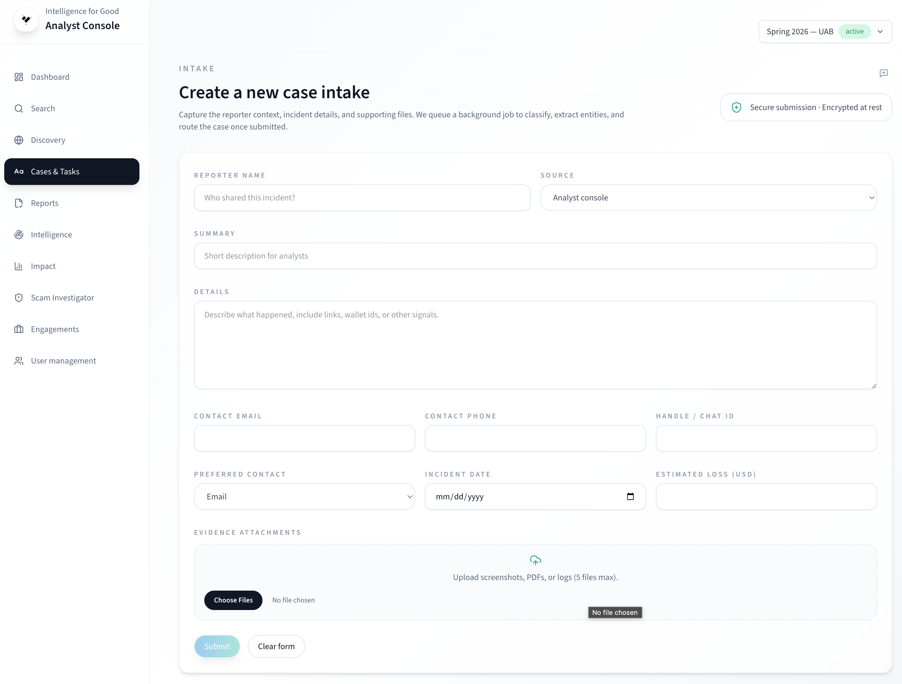

# Submitting a Report

You can submit a fraud report through the I4G web application. The process
takes about 5–10 minutes.

## Before you start

- Go to [app.intelligenceforgood.org](https://app.intelligenceforgood.org).
- Sign in with your Google account. If you can't sign in, contact your
  liaison for access.
- Gather any evidence you have: screenshots, chat logs, receipts,
  transaction records, or wallet addresses.

## Filling out the form

Click **Submit a Report** to open the intake form. Here's what you'll need
to provide:

| Field                        | Required | What to enter                                              |
| ---------------------------- | -------- | ---------------------------------------------------------- |
| **Your Name**                | Yes      | Your name (encrypted — not visible to analysts).           |
| **Summary**                  | Yes      | A one-sentence description of the scam.                    |
| **Details**                  | Yes      | The full story — what happened, when, and how.             |
| **Contact Email**            | No       | If you'd like us to follow up with you.                    |
| **Contact Phone**            | No       | Alternative contact method.                                |
| **Messaging Handle**         | No       | WhatsApp, Telegram, or other messaging app handle.         |
| **Preferred Contact Method** | No       | How you'd like to be reached (email, phone, or messaging). |
| **Incident Date**            | No       | When the scam occurred.                                    |
| **Loss Amount**              | No       | Estimated financial loss in USD.                           |
| **Attachments**              | No       | Up to 5 files — screenshots, PDFs, documents.              |

### Tips for a useful report

- **Include identifiers.** Scammer handles, wallet addresses, phone numbers,
  email addresses, and URLs are the most valuable pieces of information.
  These are what analysts use to link your report with others.
- **Be specific about dates.** "Last Tuesday" is harder to work with than
  "April 8, 2026."
- **Attach evidence.** A screenshot of a conversation or transaction receipt
  is worth more than a paragraph describing it.
- **Redact your own info.** We encrypt your contact details automatically,
  but removing unrelated personal information (bank balance, other contacts)
  from attachments speeds up review.

## After you submit

You'll see a confirmation screen with:

- A **case ID** — save this for your records.
- A status indicator showing the report was received.

Your report enters the review queue where analysts will classify the fraud,
extract entities, and assess risk. See [Following Up](following-up.md) for
what happens next.
